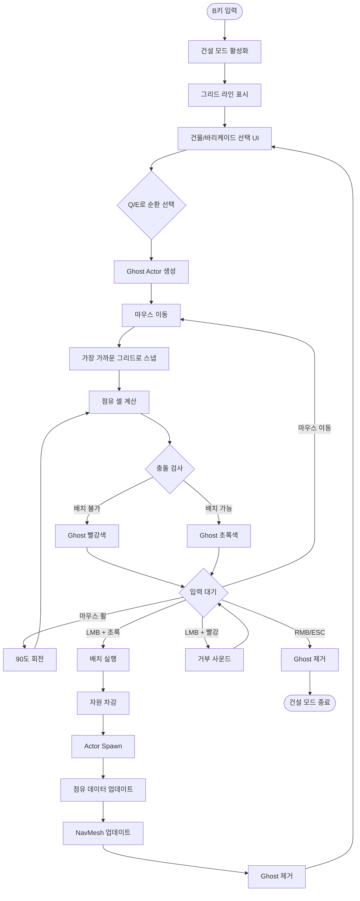
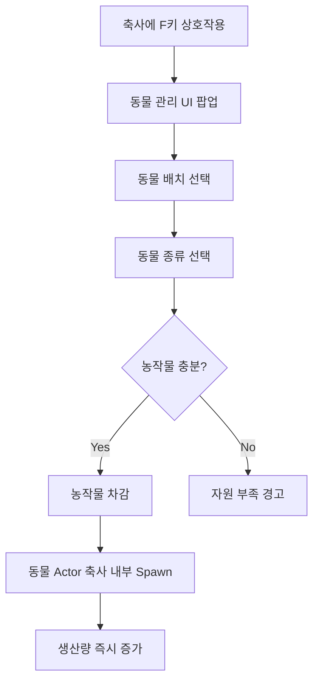
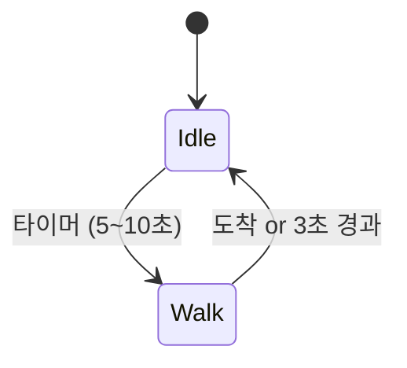
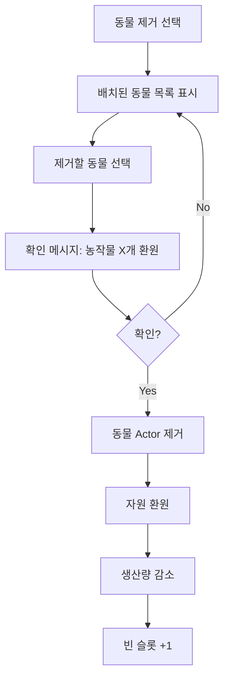
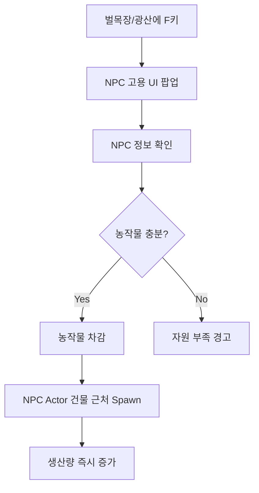
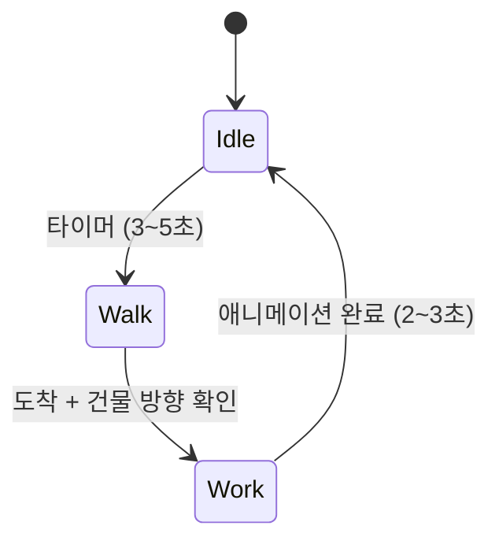
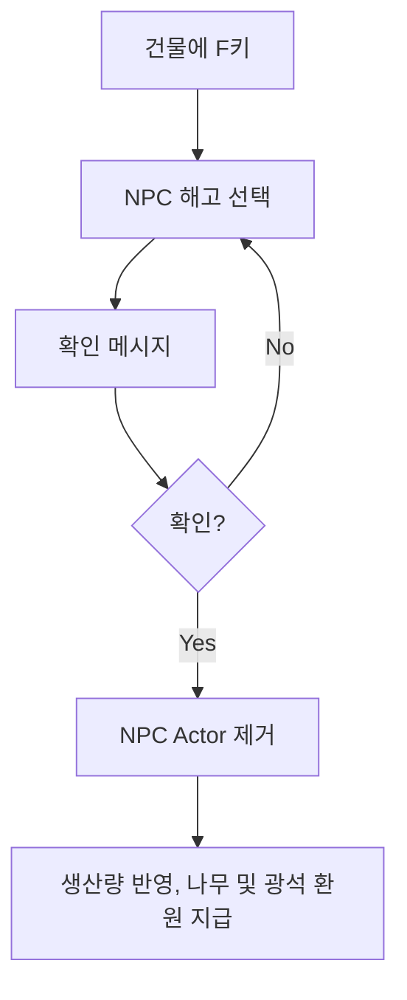
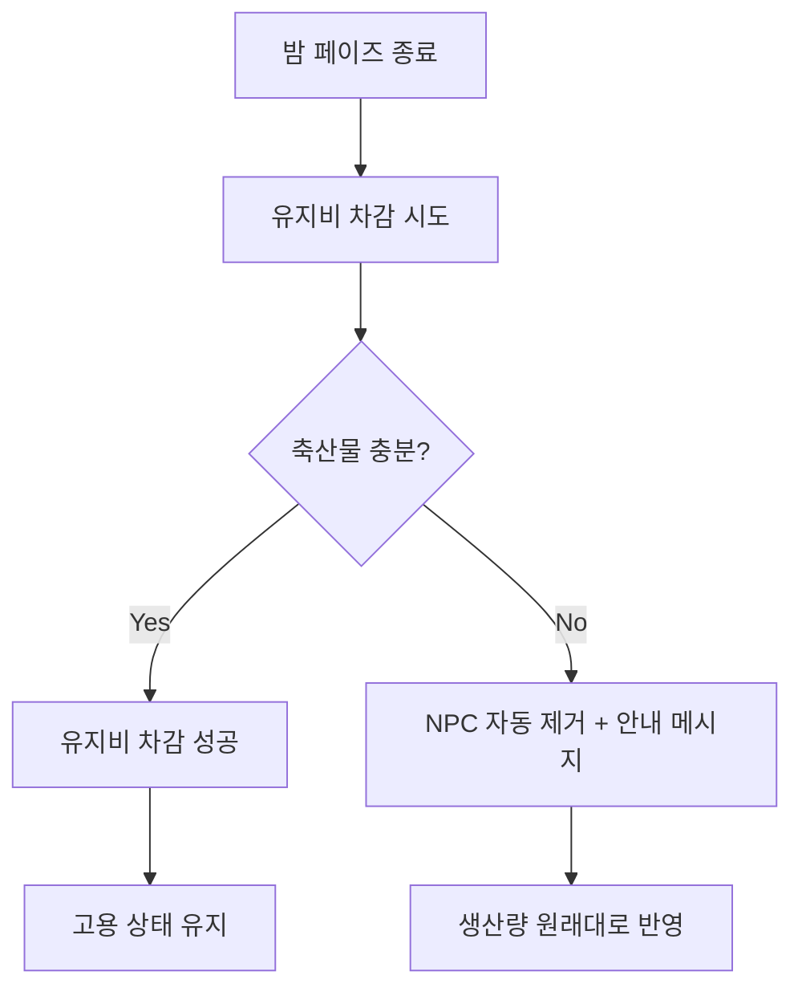
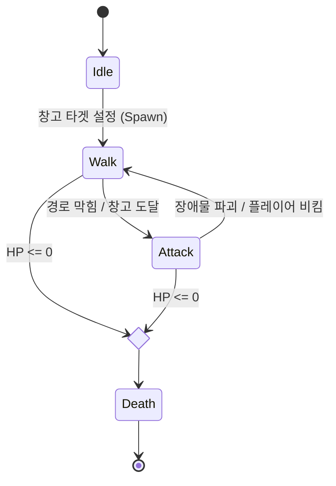

# 파머스 디펜더 - 감자마을 지키기! - 프로토타입

<aside>

</aside>

# 파머스 디펜더 (Farmer's Defender) - 게임 기획서

<aside>
💡

🌾 로우폴리 스타일의 귀여운 TPS 타워 디펜스 게임

**프로젝트 코드명**: Potato Village Defense
**개발 기간**: 2026.01 ~ (발제: 5일 후) ~ 2026.03.05
**엔진**: Unreal Engine 5.6

</aside>

## 1. 컨셉 기획

### 1-1. 게임 개요

- **프로젝트 명**: 파머스 디펜더 (Farmer's Defender)
- 가제: 감자마을 지키기!
- **장르**: TPS (3인칭 슈팅) + 타워 디펜스
- 요약 파워포인트 - Notebook LM
    
    [Farm_Shoot_Defend.pdf](attachment:88d52a2a-b1b1-471f-9442-a84ff34ff06f:Farm_Shoot_Defend.pdf)
    

### 1-2. 핵심 컨셉


### 캐치프레이즈

> "농작물로 쏘고, 동물로 키우고, 마을을 지켜라!"
> 

### 게임 핵심 경험

1. **이질적인 조합의 재미**: 귀여운 로우폴리 캐릭터들이 펼치는 치열한 방어전
2. **전략적 자원 관리**: 낮에는 농사/채집, 밤에는 생존 전투
3. **타격감**: 폭력적이지 않지만 시원한 타격감 (몬스터가 가루가 되어 사라짐)

### 차별화 포인트

- **낮/밤 사이클**: 시간에 따라 완전히 다른 게임플레이
- **자원 관리 및 건설**: 농작물, 동물, 광물 등 자원의 생산 시스템
- 해당 자원들을 이용해 바리게이트를 설치하며 몬스터 웨이브에 대비
- **비폭력적 타격감**: 피 없이도 시원한 타격감 구현

### 1-3. 톤 앤 매너 (Tone & Manner)

### [비주얼 스타일](https://www.notion.so/2e12dc3ef51481f48ea1ea812405075d?pvs=21)

- **로우폴리(Low-Poly)**: 단순하면서도 매력적인 3D 그래픽
- **과장된 애니메이션**: 만화 같은 과장된 모션과 이펙트
    
    
    

### 게임 분위기

- **밝고 유쾌함**: 긴장감 있지만 무겁지 않은 분위기
- **약간의 '약빤' 느낌**: 예상치 못한 조합과 과장된 연출
- **비폭력적**: 피 튀김 없이, 몬스터가 가루/먼지가 되어 사라지는 연출
- **정겨운 농촌 느낌**: 따뜻하고 평화로운 마을의 배경

### 참고 게임 및 스타일

- **포트나이트**: 진지 구축 시스템, 캐주얼한 슈팅감
- **러스트**: 자원 수집과 방어 구조물 설치
- **오크머스트다이**: 타워 디펜스 + 액션 조합
- **플랜츠 vs 좀비**: 식물을 활용한 방어 컨셉

### 1-4. 핵심 게임 루프


## 핵심 흐름 요약

### 1. 게임 시작

```
메인 메뉴
↓
New Game 선택
↓
즉시 1회차 낮 페이즈 시작
```

### 2. 낮 페이즈 (5분)

```
건물 건설 / 동물 배치 / NPC 고용 / 바리케이드 설치
↓
30초 남음 경고
↓
시간 종료 → 밤으로 전환
```

### 3. 밤 페이즈 (3분), (웨이브 변동 가능)

```
웨이브 1 스폰 (0초)
↓
전투
↓
웨이브 2 스폰 (60초)
↓
전투
↓
웨이브 3 스폰 (120초)
↓
전투
↓
생존 성공 → 보상
```

### 4. 회차 반복

```
NPC 유지비 차감
↓
생존 보상 획득
↓
다음 회차 낮 페이즈
(난이도 자동 증가)
```

### 5. 게임 오버

```
플레이어 사망 || 핵심 건물 파괴
↓
통계 표시 (생존 회차, 처치 수 등)
↓
해당 Wave 기준 Restart
```

### 6. 게임 종료 조건

### 승리 조건

- **최종 목표**: 모든 설계된 웨이브 생존
- **웨이브 구조**: 테이블 기반 선형 진행
- **엔딩**: 마지막 웨이브 클리어 시 승리 화면

### 패배 조건

- **플레이어 사망**: 즉시 게임 오버
- **핵심 건물 파괴**

### 7. 재시작

### 웨이브 실패

- **Restart시 실패 한 해당 Day(낮)로 설정**
- ex. 6일차 밤, Wave 3에서 실패했을 경우, 6일차 낮으로
- **게임 종료**
- Main Menu로 복귀시 진행 상황은 저장되지 않음
- **중요:** 게임 중 → Main Menu → 재시작 → 1일차 낮부터 시작

### 웨이브 테이블 구조 (예시)

| 회차 | 웨이브 | 일반 몬스터 | 엘리트 몬스터 | 보스 | 테마 |
| --- | --- | --- | --- | --- | --- |
| 1 | 1-1 | 5 | 0 | - | 튜토리얼 |
| 1 | 1-2 | 8 | 0 | - |  |
| 1 | 1-3 | 12 | 0 | - |  |
| 2 | 2-1 | 5 | 2 | - | 압박 증가 |
| ... | ... | ... | ... | ... | ... |
| 5 | 5-3 |  |  | 중간보스 | 중간 보스전 |
| ... | ... | ... | ... | ... | ... |
| 10 | 10-3 |  |  | 최종보스 | 최종 보스전 |
|  |  |  |  |  |  |

---

## 난이도 자동 증가 시스템 (사용자 경험을 중심)

**회차별 난이도 곡선:**

| 회차 | 몬스터 수 (총합) | 몬스터 HP | 몬스터 공격력 | 특징 |
| --- | --- | --- | --- | --- |
| **1회차** | 5 + 8 + 12 = 25마리 | 50 | 10 | 튜토리얼 수준 |
| **2회차** | 8 + 12 + 15 = 35마리 | 60 | 12 | 기본 난이도 |
| **3회차** | 12 + 15 + 20 = 47마리 | 70 | 14 | 건물 확장 필요 |
| **4회차** | 15 + 20 + 25 = 60마리 | 85 | 16 | NPC 고용 필수 |
| **5회차** | 20 + 25 + 30 = 75마리 | 100 | 18 | 전략적 배치 필요 |
| **6회차~** | +5마리씩 증가 | +15 HP | +2 데미지 | 계속 상승 |
| **자동 스케일링:** |  |  |  |  |
- 웨이브당 몬스터 수 증가
- 몬스터 스탯 증가
- 생존 보상도 비례 증가
- 다양한 바리게이트 설치
- 강력한 무기의 사용 (탄환 구매 비용?)

---

## 일시정지 메뉴 (Pause Menu)

**구성:**

- **Resume**: 게임 재개
- **Restart**: 해당 Day 다시 시작 (확인 필요)
- **Main Menu**: 메인 메뉴로 (확인 필요)
**확인 팝업:**

```
메인 메뉴로 돌아가시겠습니까?
현재 진행 상황이 모두 사라집니다.
[Yes] [No]
```

### 1-5. 프로토타입 목표 - (단기 구현 목표)

### 프로토타입 범위 (5일 내 발제, 기획 문서 상세화 전 구현 목표)

- [ ]  **프로젝트 기본 세팅**
- Unreal Engine 프로젝트 생성
- Git 레포지토리 구성
- 기본 폴더 구조 설정
- [ ]  **기본 맵 배치**
- 간단한 농촌 지형 (평지 + 울타리)
- 플레이어 스폰 지점
- 임시 바리케이드 배치 가능 영역 표시
- [ ]  **플레이어 컨트롤러 세팅**
- TPS 카메라 설정
- 기본 이동 (WASD)
- 마우스 시점 조작
- 점프 (Space)
- 기본 발사 입력 (LMB)
- [ ]  **임시 에셋 배치**
- 플레이어 캐릭터 (임시 모델)
- 기본 지형 텍스처
- [ ]  **핵심 기능 구현**
- 건물 배치 시스템
- 밤/낮 시스템 및 웨이브 및 몬스터 스폰

### 검증할 핵심 요소

1. **TPS 카메라 느낌**: 시점과 조작감이 편한가?
2. **기본 이동/점프**: 농촌 맵에서 이동감이 자연스러운가?
3. **입력 반응성**: 버튼 입력이 즉각적으로 반응하는가?

### 참고 에셋 목록

### 캐릭터/동물

- [로우폴리 동물들](https://fab.com/s/0c919450affc) - 기본 동물 NPC
- [동물 + 애니메이션](https://fab.com/s/7b34c4b16872)
- [Moles and Hammers](https://fab.com/s/ddf609034197) - 두더지 에셋
- [농부 캐릭터](https://fab.com/s/b1199177c96f)

### 환경/맵

- [농촌 맵 에셋](https://fab.com/s/5c6e158bb08f) - 로우폴리 농촌
- [마을 맵1](https://www.fab.com/ko/listings/52529a12-e88e-41a0-8834-b87306f20c24)
- [마을 맵2](https://www.fab.com/ko/listings/d7408876-2301-468a-a2e9-6eea38ddc10d)
- [Cropout Sample Project](https://fab.com/s/f06519f0e24f) - 농작물 에셋
- [GameDev Starter Kit - Farming [Free Edition] | Fab](https://www.fab.com/ko/listings/fd545301-e55f-4705-a777-d62fbe39e72d) - 농작물 에셋
- https://fab.com/s/96af91450efc

### 몬스터

- [기본 몬스터](https://www.fab.com/ko/listings/4e291d69-9825-4bb6-913e-e30c0d76bb73) - ₩1,500
- [해골 + 애니메이션](https://fab.com/s/c4b424971e41)
- [몬스터 에셋](https://fab.com/s/f06519f0e24f)

### 아이템/소품

- [묘비 에셋](https://www.fab.com/ko/listings/3a962727-4041-4020-9244-7fef34c3053c)
- [포션 아이템](https://www.fab.com/ko/listings/02f122bf-71af-46b8-81d4-0b8fb064ccaa)
- [무기 (총, 대포)](https://fab.com/s/5aea1bada1cb)

### VFX

- [사격 Trail](https://www.fab.com/listings/e9ef0d68-02a1-4954-b6c3-d05c931c19bc)
- [폭발 이펙트](https://www.fab.com/listings/e9ef0d68-02a1-4954-b6c3-d05c931c19bc)

### UI

- https://kenney.nl/assets/tag:interface

[UX_UI기획(안)_260211.pptx](attachment:3dd0dfae-8769-4ae5-a0fa-10021b046741:UX_UI기획(안)_260211.pptx)

## 2. 시스템 기획

### 2-1. 플레이어 조작 시스템 (Input System)

### 2-1-1. 기본 이동 및 시점

| 입력 | 기능 | 비고 |
| --- | --- | --- |
| **W/A/S/D** | 전후좌우 이동 | 표준 FPS 이동 |
| **Space** | 점프 | 단일 점프 |
| **Shift (Hold)** | 달리기 | 이동속도 1.5배 |
| **Mouse Move** | 카메라 회전 | TPS 시점 조작 |
| **Mouse Scroll(선택)** | 카메라 줌 인/아웃 | 거리 조절 (선택) |

---

### 2-1-2. 전투 액션

| 입력 | 기능 | 비고 |
| --- | --- | --- |
| **LMB (Left Click)** | 발사 | 장착한 농작물 발사 |
| **RMB (Right Click)** | 조준 | 줌 인 조준 (선택) |
| **R** | 재장전 | 농작물 탄창 교체 |
| **1/2/3/4** | 무기(농작물) 교체 | 슬롯 전환 |

---

### 2-1-3. 건설 모드

| 입력 | 기능 | 비고 |
| --- | --- | --- |
| **B** | 건설 모드 진입/종료 | UI 오버레이 표시 |
| **마우스 이동** | 가배치 오브젝트 이동 | Ray Cast 기반 위치 결정 |
| **Mouse Wheel** | 가배치 오브젝트 회전 | Y축 기준 90도씩 회전 |
| **LMB** | 건물/바리케이드 배치 | 초록색 상태일 때만 가능 |
| **RMB** | 건설 취소 | 건설 모드 유지 |
| **Q/E** | 건물 종류 순환 | 이전/다음 건물 |

---

### 2-1-4. 상호작용

| 입력 | 기능 | 비고 |
| --- | --- | --- |
| **F** | 상호작용 | 자원 수집, 건물 UI 열기 |
| **Tab** | 인벤토리/스탯 창 | 일시정지 + UI 표시 |
| **ESC** | 메뉴 | 일시정지 메뉴 |

---

### 2-2. 낮/밤 사이클 시스템

### 2-2-1. 시간 흐름 구조


### 2-2-2. 낮/밤 페이즈 비교

| 구분 | 낮 페이즈 (Day) | 밤 페이즈 (Night) |
| --- | --- | --- |
| **목표** | 밤을 대비한 준비 | 몬스터 웨이브 방어 |
| **지속 시간** | 5분 | 3분 (변경 가능, 오히려 길어질 수 있음) |
| **건물 배치** | ✅ 가능 (정상 비용) | ❌ 불가 |
| **바리케이드 설치** | ✅ 가능 (정상 비용) | ✅ 가능 (2배 비용) |
| **동물 배치** | ✅ 가능 | ❌ 불가 |
| **자원 수집** | ✅ 가능 (자동 생산) | ❌ 생산 중단 |
| **바리케이드 수리** | ✅ 가능 | ❌ 불가 |
| **전투** | ❌ 몬스터 없음 | ✅ 웨이브 방어 필수 |
| **몬스터** | 없음 | 3~5 웨이브 출현 |

### 2-2-3. 환경 및 UI

| 요소 | 낮 페이즈 | 밤 페이즈 |
| --- | --- | --- |
| **조명** | 밝은 태양광 (Directional Light 강도 높음) | 어두운 달빛만 |
| **배경음악** | 부드럽고 평화로운 BGM | 긴장감 있는 전투 BGM |
| **시각 효과** | - | 안개 효과 (선택) |
| **시간 표시** | "DAY - 4:32 남음" (HUD 상단) | "NIGHT - 2:15 남음" (HUD 상단) |
| **경고** | 30초 남을 때 효과음 + UI 깜빡임 | 웨이브 알림 |

### 2-2-4. 게임 종료 조건

| 조건 | 결과 |
| --- | --- |
| **플레이어 사망** | 게임 오버 |
| **창고 파괴** | 게임 오버 |
| **밤 페이즈 생존** | 보상 획득 + 낮 페이즈로 복귀 |

**생존 보상:**

- 자원 (나무, 광석, 농작물)
- 특수 아이템 (선택, 추후 논의, 생략하는 것이 좋아보임)
- 다음 웨이브 준비 시간 부여

### 2-3. 자원 시스템


### 2-3-1. 자원 종류 및 용도

| 자원명 | 아이콘 | 획득 방법 | 주요 용도 | 부가 용도 |
| --- | --- | --- | --- | --- |
| **나무** | 🪵 | 벌목장 (건물) | 모든 기본 건물 건설 | 바리케이드, 수리 |
| **광석** | ⛏️ | 광산 (건물) | 고급 바리케이드 (석벽 등) | 특수 건물 (추후) |
| **농작물** | 🌾 | 밭 (건물) | 탄약 (발사체) | 동물 구매, NPC 고용 |
| **축산물** | 🥛 | 축사 (동물 배치) | NPC 유지비 | 동물 교환 (추후) |

**자원 순환 구조:**

```cpp
나무 → 건물 건설 → 자원 생산
농작물 → NPC 고용 → 생산량 증가
축산물 → NPC 유지 → 지속적 생산
```

### 2-3-2. 건물별 자원 생산 구조

### 생산 건물 개요

| 건물명 | 건설 비용 | 크기 | 기본 생산 | NPC 배치 효과 | 특징 |
| --- | --- | --- | --- | --- | --- |
| **밭** | 나무 8 | 3m x 2m | 농작물 +3/분 | - | 농작물 전용 생산 |
| **축사** | 나무 12 | 3m x 3m | - | 동물 배치로 축산물 생산 | 최대 5마리 |
| **벌목장** | 나무 5 | 2m x 2m | 나무 +1/분 | 벌목꾼 배치 시 +50% | NPC 고용 가능 |
| **광산** | 나무 8, 광석 5 | 2m x 2m | 광석 +0.5/분 | 광부 배치 시 +100% | NPC 고용 가능 |

### 밭 (농작물 생산)

| 항목 | 내용 |
| --- | --- |
| **건설 비용** | 나무 8 |
| **크기** | 3m x 2m |
| **기본 생산량** | 농작물 +3/분 |
| **5분 낮 페이즈 총 획득** | 15개 |
| **NPC 배치** | 불가 |
| **업그레이드** | 불가 (프로토타입) |
| **전략적 활용** | - 탄약 확보를 위한 핵심 건물- 초반 최우선 건설- 최소 2~3개 권장 |

### 축사 (축산물 생산)

| 항목 | 내용 |
| --- | --- |
| **건설 비용** | 나무 12 |
| **크기** | 3m x 3m |
| **기본 생산량** | 없음 (동물 배치 필요) |
| **최대 동물 배치** | 5마리 |
| **동물 교체** | 가능 (동물 제거 → 축산물로 일부 환원) |
| **업그레이드** | 불가 (프로토타입) |
| **전략적 활용** | - NPC 유지비 생산- 중반 이후 건설- 동물 조합 최적화 필요 |

**동물 시스템:**

| 동물 | 구매 비용 | 생산 효과 | 제거 시 환원 | 배치 제한 |
| --- | --- | --- | --- | --- |
| **소** | 농작물 5 | 농작물 +1/분 | 농작물 2 | 5마리/축사 |
| **돼지** | 농작물 5 | 축산물 +1/분 | 농작물 2 | 5마리/축사 |
| **닭** | 농작물 3 | 농작물 +0.5/분축산물 +0.5/분 | 농작물 1 | 5마리/축사 |

**동물 교체 시스템:**

```cpp
1. 축사에서 [F] 상호작용
    ↓
2. 배치된 동물 목록 표시
    ↓
3. 제거할 동물 선택
    ↓
4. 확인 → 동물 제거 + 일부 자원 환원
    ↓
5. 빈 슬롯에 새 동물 배치 가능
```

**생산량 예시:**

```cpp
[축사 + 돼지 3마리 + 닭 2마리]
= 축산물 (1 × 3) + (0.5 × 2) = 4/분
= 농작물 (0.5 × 2) = 1/분

[5분 낮 페이즈]
= 축산물 20개, 농작물 5개
```

### 벌목장 (나무 생산)

| 항목 | 내용 |
| --- | --- |
| **건설 비용** | 나무 5 |
| **크기** | 2m x 2m |
| **기본 생산량** | 나무 +1/분 |
| **NPC 배치** | 벌목꾼 (농작물 5로 고용) |
| **NPC 효과** | 나무 생산량 증가 (+ 분당 고정수치) |
| **전략적 활용** | - 초반 필수 건물- 최소 2~3개 건설 권장- NPC 고용 시 효율 대폭 증가 |

### 광산 (광석 생산)

| 항목 | 내용 |
| --- | --- |
| **건설 비용** | 나무 8, 광석 5 |
| **크기** | 2m x 2m |
| **기본 생산량** | 광석 +0.5/분 |
| **NPC 배치** | 광부 (농작물 8로 고용) |
| **NPC 효과** | 광석 생산량 증가 (+ 분당 고정수치) |
| **전략적 활용** | - 중반 이후 건설- NPC 필수 (생산량 2배)- 석벽 방어 전략 시 필수 |

### 2-3-3. NPC 시스템

### NPC 종류 및 효과

| NPC 종류 | 배치 건물 | 고용 비용 | 생산량 증가 | 유지비 (밤마다) | 최대 배치 |
| --- | --- | --- | --- | --- | --- |
| **벌목꾼** | 벌목장 | 농작물 5 | 나무 고정수치 증가 | 축산물 1 | 3명/건물 |
| **광부** | 광산 | 농작물 8 | 광석 고정수치 증가 | 축산물 2 | 3명/건물 |

### NPC 고용 시스템

**고용 프로세스:**

```cpp
1. 건물에 [F] 상호작용
    ↓
2. "NPC 고용" 메뉴 선택
    ↓
3. 농작물 소모 확인
    ↓
4. 확인 → NPC 배치 + 생산량 즉시 증가
```

**NPC 유지비 시스템:**

```cpp
[밤 페이즈 종료 시]
    ↓
각 NPC의 유지비 자동 차감
    ↓
축산물 부족 시 → 경고 메시지
    ↓
다음 낮 페이즈에도 미지급 시
    ↓
NPC 퇴직 (건물에서 제거) + 생산량 원래대로
```

**NPC 재고용:**

- 퇴직한 NPC는 다시 고용 가능 (삭제 후 재추가
- 동일한 비용 (농작물) 소모
- 즉시 배치 및 생산량 증가

### NPC 전략

| 시기 | 추천 NPC 구성 | 이유 |
| --- | --- | --- |
| **초반 (1~2회차)** | NPC 없음 | 농작물을 탄약에 집중 |
| **중반 (3~4회차)** | 벌목꾼 1~2명 | 나무 생산량 증가로 건물 확장 |
| **후반 (5회차~)** | 벌목꾼 2명 + 광부 1명 | 고급 바리케이드 활용 |

**비용 대비 효과:**

```cpp
[벌목꾼 예시]
고용 비용: 농작물 5
유지비: 축산물 1/밤
효과: 나무 +0.5/분 = 5분당 +2.5개

[5회차 기준]
총 유지비: 축산물 5개
총 추가 생산: 나무 12.5개 → 12개
→ 건물 1~2개 또는 바리케이드 4개 추가 건설 가능
```

### 2-3-4. 자원 소비 구조 - 임시

### 건물 건설 비용

| 건물 | 나무 | 광석 | 농작물 | 축산물 | 건설 시간 |
| --- | --- | --- | --- | --- | --- |
| **밭** | 8 | - | - | - | 즉시 |
| **축사** | 12 | - | - | - | 즉시 |
| **벌목장** | 5 | - | - | - | 즉시 |
| **광산** | 8 | 5 | - | - | 즉시 |

### 전투 소비 (탄약)

| 농작물 | 탄창 크기 | 소모량/발 | 재장전 소모 | 특징 |
| --- | --- | --- | --- | --- |
| **감자** | 30발 | 1개 | 30개 | 기본 탄환 |
| **옥수수** | 30발 | 1개 | 30개 | 관통 |
| **호박** | 10발 | 3개 | 30개 | 폭발 (비쌈) |
| **당근** | 50발 | 1개 | 50개 | 연사 (소모 많음) |

### 기타 소비

| 행동 | 비용 | 비고 |
| --- | --- | --- |
| **바리케이드 수리** | 원래 건설 비용의 50% | 낮 페이즈만 가능 |
| **긴급 건설 (밤)** | 원래 건설 비용의 200% | 바리케이드만 가능 |
| **NPC 고용** | 농작물 (종류별 상이) | 1회성 비용 |
| **NPC 유지비** | 축산물 (종류별 상이) | 매 밤 페이즈 종료 시 |
| **동물 구매** | 농작물 (종류별 상이) | 1회성 비용 |

### 2-3-5. 자원 저장 및 관리

**저장 방식:**

- 플레이어 인벤토리 (무제한)

**HUD 표시:**

```cpp
좌측 상단:
🪵 나무: 45
⛏️ 광석: 23
🌾 농작물: 120
🥛 축산물: 8
```

### 2-3-6. 밸런싱 (추후 정리 후 4-1로)

> 참고: 자원 생산/소비 밸런싱, 성장 곡선, 난이도별 조정 등은 프로토타입 플레이테스트 후 상세 기획 단계에서 작성 예정
> 

**고려사항:**

- 낮 페이즈 5분 동안 적정 자원 획득량
- NPC 유지비와 생산량 증가 균형
- 밤 페이즈 소비량과의 균형
- 회차별 성장 곡선
- 건물 건설 우선순위 가이드
- 동물/NPC 조합 최적화 전략

---

### 2-4-A. 건물 배치 시스템


### 2-4-1. 건물 종류 및 기본 정보

### 건물 데이터 테이블

| **건물명** | **그리드 크기** | **실제 크기** | 에셋 명 |
| --- | --- | --- | --- |
| **밭** | 6x4 | 3m x 2m | SM_PotatoFarm |
| **축사** | 6x4 | 3m x 2m | SM_PotatoBarn |
| **벌목장** | 4x4 | 2m x 2m | SM_PotatoLumberMill |
| **광산** | 4x4 | 2m x 2m | SM_PotatoMine |
| **식량 저장고** | 8x8 | 4m x 4m | SM_PotatoMealStorage |

**참고:**

- 모든 크기는 0.5m 그리드 기준
- 그리드 크기 6x4 = 가로 6칸 x 세로 4칸 = 실제 3m x 2m

### 바리케이드 데이터 테이블

| **이름** | **그리드 크기** | **실제 크기** | 에셋 명 |
| --- | --- | --- | --- |
| **나무 울타리** | 4x1 | 2m x 0.5m | Fence |
| **석벽** | 2x2 | 1m x 1m | Stone_fence |
| **수레** | 3x3 | 1.5m x 1.5m | SM_PotatoCart |
| **나무통** | 1x1 | 0.5m x 0.5m | Barrel |
| **가시 울타리** | 6x1 | 3m x 0.5m | SM_PROP_spikes_v02_03 |

---

### 식량 저장고 (핵심 건물)

| **항목** | **내용** |
| --- | --- |
| **배치 시점** | 게임 시작 시 맵 중앙 그리드에 사전 배치 |
| **그리드 위치** | (46, 46) ~ (53, 53) ※ 100x100 그리드 중앙 |
| **이동/파괴** | 불가 |
| **HP** | 1000 |
| **기능** | - 몬스터의 최종 목표- 파괴 시 즉시 게임 오버 |
| **전략적 중요성** | 방어선의 중심점 |

### 2-4-2. 배치 메커니즘 (그리드 배치 방식)

### 그리드 시스템 개요

**통합 그리드 설정:**

- **그리드 크기**: 1칸 = 50cm x 50cm (0.5m x 0.5m)
- **배치 영역**: 맵 중앙 50m x 50m
- **모든 건물/바리케이드**: 동일한 그리드 사용

**좌표 체계:**

- X축: 0 ~ 99 (좌 → 우)
- Y축: 0 ~ 99 (하 → 상)
- 원점 (0, 0): 맵 중앙 원점 좌표 설정

**참고 이미지 스타일:**


- 다양한 형태(수레, 나무통 등) 지원

### **배치 프로세스**



**건설 모드 취소:**

- ESC 또는 RMB → Ghost 파괴, 일반 모드로 복귀

**건설 모드 취소:**

- ESC 또는 RMB → Ghost 파괴, 일반 모드로 복귀

### 그리드 점유 계산

**기본 원칙:**

- 오브젝트의 **좌측 하단 모서리**가 기준점
- 기준점에서 GridWidth x GridHeight 만큼 셀 점유

**예시 1: 밭 (6x4) 배치**

```
그리드 좌표: X축 (10-15), Y축 (20-23)
점유 셀: 24개

    10  11  12  13  14  15
   ┌───┬───┬───┬───┬───┬───┐
23 │ ■ │ ■ │ ■ │ ■ │ ■ │ ■ │
   ├───┼───┼───┼───┼───┼───┤
22 │ ■ │ ■ │ ■ │ ■ │ ■ │ ■ │
   ├───┼───┼───┼───┼───┼───┤
21 │ ■ │ ■ │ ■ │ ■ │ ■ │ ■ │
   ├───┼───┼───┼───┼───┼───┤
20 │ ■ │ ■ │ ■ │ ■ │ ■ │ ■ │ ← 기준점 (10, 20)
   └───┴───┴───┴───┴───┴───┘

■ = 밭이 점유하는 셀 (초록색 Ghost)
실제 크기: 3m x 2m
```

**예시 2: 나무통 (1x1) 배치**

```
그리드 좌표: (45, 67)
점유 셀: 1개

    45
   ┌───┐
67 │ ● │ ← 나무통
   └───┘

● = 나무통 (0.5m x 0.5m)
용도: 좁은 틈새 메우기
```

---

**예시 3: 가시 울타리 (6x1) 회전**

```
0도 회전 (가로):
┌───┬───┬───┬───┬───┬───┐
│ ▬ │ ▬ │ ▬ │ ▬ │ ▬ │ ▬ │
└───┴───┴───┴───┴───┴───┘
실제 크기: 3m x 0.5m

90도 회전 (세로):
┌───┐
│ ▬ │
├───┤
│ ▬ │
├───┤
│ ▬ │
├───┤
│ ▬ │
├───┤
│ ▬ │
├───┤
│ ▬ │
└───┘
실제 크기: 0.5m x 3m
```

---

**예시 4: 배치 불가 상태 (충돌)**

```
기존 건물과 겹침:

┌───┬───┬───┐
│   │   │   │ 기존 건물 (회색)
├───┼───┼───┤
│   │ X │ X │
└───┴───┴───┘
    │ X │ X │ 새 건물 시도 (빨강)
    └───┴───┘

X = 충돌 영역
→ 빨강색 Ghost 표시
→ LMB 클릭 시 거부 사운드
```

---

### 충돌 검사 규칙

**배치 가능 조건 (모두 만족 시 초록):**

1. 모든 점유 셀이 0~99 범위 내
2. 점유할 셀에 다른 오브젝트 없음
3. 플레이어 보유 자원 >= 건설 비용

**배치 불가 조건 (하나라도 해당 시 빨강):**

- 경계 밖으로 벗어남
- 다른 건물/바리케이드와 겹침
- 자원 부족

---

### 그리드 시각화

**건설 모드 활성화 시:**

| 요소 | 표시 방법 |
| --- | --- |
| **그리드 라인** | 흰색 반투명 (10%), 0.5m 간격 |
| **Ghost (배치 가능)** | 초록색 반투명 (50%) |
| **Ghost (배치 불가)** | 빨강색 반투명 (50%) |
| **기존 건물/바리케이드** | 원래 색상 (불투명) |

**일반 모드:**

- 그리드 라인 숨김
- 오브젝트만 표시

### 회전 시스템

**회전 각도:**

- 0°, 90°, 180°, 270° (90도 단위)

**회전 시 크기 변화:**

| 오브젝트 | 0° / 180° | 90° / 270° |
| --- | --- | --- |
| **밭 (6x4)** | 가로 6칸, 세로 4칸 | 가로 4칸, 세로 6칸 |
| **나무 울타리 (4x1)** | 가로 4칸, 세로 1칸 | 가로 1칸, 세로 4칸 |
| **석벽 (2x2)** | 2x2 (변화 없음) | 2x2 (변화 없음) |

**회전 후:**

- 점유 셀 재계산
- 충돌 검사 재실행
- Ghost 색상 업데이트 (초록/빨강)

---

### 피드백 시스템

**시각 피드백:**

- ✅ **초록 Ghost**: 배치 가능, LMB로 즉시 배치
- ❌ **빨강 Ghost**: 배치 불가, LMB 클릭 시 거부 사운드

**사운드 피드백:**

- 배치 성공: "툭" 설치음 (Build_Place_Success)
- 배치 거부: "삐" 거부음 (UI_Error_01)

### Custom Collision Channel 설정

**ECC_BuildingPlacement:**

- **Blocking** : Building, Barricade, Landscape
- **Overlapping** : Player, Monster
- **Ignoring** : Projectile

<aside>
💡 ※ 이 채널은 건설 모드 Ghost의 배치 가능 여부 판정에만 사용
몬스터 AI의 장애물 감지는 BlockAll 채널을 별도 사용
(2-4-4 참조)

</aside>

### 2-4-3. 건물 상호작용

### 상호작용 트리거

- **방식:**
    - 건물 근처 (3m 이내) → [F] 키 프롬프트 표시
    - [F] 입력 → 상호작용 UI 팝업

**건물별 상호작용 메뉴**

| **건물** | **상호작용 메뉴** |
| --- | --- |
| **밭** | - (없음, 자동 생산만) |
| **축사** | 동물 배치, 동물 제거, 닫기 |
| **벌목장** | NPC 고용, NPC 해고 (고용 시), 닫기 |
| **광산** | NPC 고용, NPC 해고 (고용 시), 닫기 |
| **창고** | - (없음) |

### 상호작용 프롬프트

**HUD 표시**

Plaintext

```cpp
[건물 근처 시]
화면 중앙 하단:
┌──────────────────┐
│ [F] 축사 열기    │
└──────────────────┘
```

### 2-4-4. 배치 오브젝트의 Actor 판정 및 AI 영향

### 설계 원칙

<aside>
💡 **이 섹션의 목적**:
"배치된 오브젝트가 몬스터 AI에게
어떻게 인식되고, 어떤 영향을 미치는가"

NavMesh는 지형 정보만 담당
오브젝트 판정은 몬스터 AI가 직접 처리

</aside>

### Actor 태그 분류

| 태그 | 대상 | 몬스터 AI 반응 |
| --- | --- | --- |
| `Obstacle` | 바리케이드, 생산 건물 | 경로 차단 시 공격 |
| `Target` | 창고 | 최종 목적지, 도달 시 공격 |

```jsx
몬스터가 인식하는 세계:
- "부숴야 할 것" (Obstacle) - 경로를 막고 있을 때
- "도달해야 할 것" (Target)
- "무시할 것" (그 외 모든 것 - 경로 밖 플레이어 포함)
```

### Collision 채널 설계

| 채널 | 바리케이드 | 생산 건물 | 창고 | 플레이어 | 몬스터 |
| --- | --- | --- | --- | --- | --- |
| `ECC_Pawn` | Block | Block | Block | Block | Block |
| `ECC_Visibility` | Block | Block | Block | Block | Block |
| `BlockAll` | **Block** | **Block** | Block | **Block** | Ignore |

```jsx
CheckPathObstacles Trace:
BlockAll 채널 사용
→ 바리케이드, 생산 건물, 플레이어 모두 동일 채널로 감지
→ 감지 후 Actor 태그로 구분하여 처리
   - Obstacle 태그 → 공격
   - 플레이어 (Overlap) → 공격
   - Target 태그 → 창고 공격 시작
```

### Actor 감지 방식

**전방 Trace (이동 중 장애물 감지):**

```jsx
몬스터 전방 2m, 폭 1.5m Box Trace (BlockAll 채널)
    ↓
Hit Actor 존재?
    ↓
Yes → Actor 태그 확인
    ├─ Obstacle → CurrentTarget 설정 → 공격
    └─ Target (창고) → 창고 공격 시작
No → 계속 이동
```

**Overlap 이벤트 (플레이어 경로 차단 감지):**

```jsx
몬스터 Capsule에 Overlap 발생
    ↓
Overlap Actor 확인
    ├─ 플레이어 → 이동 경로(Forward Vector) 상에 위치?
    │     ├─ Yes → CurrentTarget 설정 → 공격
    │     └─ No → 무시 (경로 밖)
    └─ 그 외 → 무시
```

---

### AI에 미치는 영향

**바리케이드/생산 건물 배치 시:**

```jsx
Actor 월드에 Spawn
    ↓
BlockAll Collision 활성화
    ↓
몬스터 전방 Trace에 감지됨
    ↓
Obstacle 태그 확인 → CurrentTarget 설정 → Attack 상태
```

**바리케이드/생산 건물 파괴 시:**

```jsx
Actor Destroy
    ↓
Collision 제거
    ↓
전방 Trace에 감지 안 됨
    ↓
CurrentTarget = NULL → Walk 상태 복귀 → 창고로 이동 재개
```

**경로 외부 오브젝트:**

```jsx
바리케이드/플레이어가 경로 옆에 존재
    ↓
전방 Trace 범위(전방 2m, 폭 1.5m) 밖
    ↓
감지 안 됨 → 완전 무시
→ 몬스터는 창고를 향해 계속 이동
```

### 상세 AI 행동 로직 참조

```jsx
Actor 판정 이후의 행동 로직
(Behavior Tree, Task 상세, Blackboard 변수 등)
→ 2-7. 몬스터 시스템 참조
```

### 2-4-B. NPC/동물 배치 시스템

### 2-4-5. 동물 배치 시스템

### 배치 프로세스

코드 스니펫



### 동물 관리 UI

**메인 관리 화면**

```
┌────────────────────────────────────┐
│   [축사] 동물 관리                 │
├────────────────────────────────────┤
│ 현재 배치: 3 / 5마리               │
│                                    │
│ [소]   농작물 +1/분  (2마리)      │
│ [닭]   농작물/축산물 +0.5/분 (1마리)│
│                                    │
├────────────────────────────────────┤
│ 빈 슬롯: 2개                       │
│                                    │
│ [동물 배치]  [동물 제거]  [닫기]  │
└────────────────────────────────────┘
```

**동물 선택 팝업**

```
┌────────────────────────────────────┐
│   동물 선택                         │
├────────────────────────────────────┤
│ [소]   비용: 농작물 5              │
│        효과: 농작물 +1/분          │
│                                    │
│ [돼지] 비용: 농작물 5              │
│        효과: 축산물 +1/분          │
│                                    │
│ [닭]   비용: 농작물 3              │
│        효과: 농작물/축산물 +0.5/분 │
│                                    │
│        [구매]        [취소]        │
└────────────────────────────────────┘
```

### 동물 Actor 동작

**배치:**

- 축사 내부 랜덤 위치에 Spawn
- 축사 경계 내에서만 배회

**Collision:**

- 없음 (장식용)
- 플레이어 이동에 방해되지 않음

**애니메이션:**

- Idle (대기)
- Walk (축사 내부 배회)

**AI 동작 (매우 단순):**



**Blackboard 변수:**

| 변수명 | 타입 | 설명 |
| --- | --- | --- |
| `BarnActor` | Object | 배치된 축사 Actor |
| `BarnBounds` | Box | 축사 경계 영역 |

**동작 규칙:**

- 5~10초마다 축사 내부 랜덤 위치로 이동
- 항상 축사 경계 내에서만 이동

**Behavior Tree**

```jsx
[Root]
└─ [Sequence] 배회 루프
    ├─ [Task] Wait          ← UE5 기본 제공 / 5~10초 랜덤
    ├─ [Task] PickRandomLocation   ← 커스텀
    └─ [Task] MoveTo        ← UE5 기본 제공
```

### 동물 제거 시스템

**제거 프로세스**

코드 스니펫



**환원 자원 테이블**

| **동물 종류** | **환원 자원** |
| --- | --- |
| **소 / 돼지** | 농작물 2개 |
| **닭** | 농작물 1개 |

---

### 2-4-6. NPC 배치 시스템

### 배치 프로세스

코드 스니펫



### NPC 고용 UI (예시: 벌목장)

```
┌────────────────────────────────────┐
│   [벌목장] NPC 고용                │
├────────────────────────────────────┤
│ 현재 생산량: 나무 +1/분            │
│                                    │
│ [벌목꾼 고용]                      │
│ - 비용: 농작물 5                   │
│ - 효과: 나무 생산 +50% (+0.5/분)   │
│ - 유지비: 축산물 1 (매 밤)         │
│                                    │
│ 고용 후 생산량: 나무 +1.5/분       │
│                                    │
│        [고용]        [취소]        │
└────────────────────────────────────┘
```

### NPC Actor 동작

**배치:**

- 해당 건물 근처 지정 위치에 Spawn
- 건물 중심으로부터 2~3m 반경 내 배회

**기능:**

- 고용 즉시 건물의 생산 효율 증가 (변수 적용)
- 시각적 요소로만 존재 (실제 자원 생산은 건물이 담당)

**Collision:**

- 있음 (Capsule Component)
- 플레이어/몬스터와 충돌

---

## NPC AI Behavior Tree



**State 설명:**

| State | 설명 | 애니메이션 | 지속시간 |
| --- | --- | --- | --- |
| **Idle** | 대기 상태 | Idle | 3~5초 (랜덤) |
| **Walk** | 건물 주변 배회 | Walk | 거리에 따라 |
| **Work** | 작업 수행 | 도끼질/곡괭이질 | 2~3초 |

**Behavior Tree 구조:**

```
[Root]
└─ [Sequence] 배회-작업 루프
    ├─ [Task] Wait                     ← UE5 기본 제공 / 3~5초 랜덤
    ├─ [Task] PickRandomLocation       ← 커스텀
    ├─ [Task] MoveTo TargetLocation    ← UE5 기본 제공
    └─ [Sequence] 방향 확인 후 작업
        ├─ [Decorator] IsFacingBuilding   ← 커스텀
        └─ [Task] PlayWorkAnimation       ← 커스텀
```

**Blackboard 변수:**

| 변수명 | 타입 | 설명 |
| --- | --- | --- |
| `AssignedBuilding` | Object | 고용된 건물 Actor 참조 |
| `PatrolCenter` | Vector | 배회 중심점 (건물 위치) |
| `PatrolRadius` | Float | 배회 반경 (2~3m) |
| `TargetLocation` | Vector | 현재 이동 목표 지점 |

**Task 상세:**

1. **Wait Task**:
    - 3~5초 랜덤 대기
2. **PickRandomLocation Task**:
    - 건물 중심에서 2~3m 반경 내 랜덤 위치 선택
    - NavMesh 유효성 확인
3. **MoveTo Task**:
    - 선택된 위치로 이동
    - 도착 허용 거리: 50cm
4. **PlayWorkAnimation Task**:
    - 벌목꾼: 도끼질 몽타주
    - 광부: 곡괭이질 몽타주
    - 2~3초 재생 후 완료

### NPC 퇴직 시스템

**1. 수동 해고 (플레이어 선택)**

코드 스니펫



**2. 자동 퇴직 (유지비 미지급)**

코드 스니펫


### 2-5. 바리케이드 시스템


### 2-5-1. 바리케이드 종류 (예시)

| 이름 | 건설 비용 | HP | 특수 효과 | 형태 |
| --- | --- | --- | --- | --- |
| **나무 울타리** | 나무 3 | 100 | 없음 | 직선형 (2m) |
| **석벽** | 나무 5, 광석 3 | 250 | 몬스터 이동속도 -20% | 블록형 (2m) |
| **수레** | 나무 4 | 150 | 엄폐물 제공 | 불규칙 |
| **나무통** | 나무 2 | 80 | 파괴 시 나무 1 회수 | 원형 (소형) |
| **가시 울타리** | 나무 4, 농작물 5 | 80 | 접촉 시 10 데미지 | 긴 직선 (3m) |

---

### 2-5-2. 배치 특징

**건물 시스템과 동일:**

- 자유 배치 방식 (Ray Cast + Collision)
- 회전 가능
- Mesh 형태 그대로 검사하여 불규칙한 형태도 정교하게 배치

**전략적 활용:**

- **수레**: 측면으로 뉘어서 엄폐물로 활용
- **나무통**: 좁은 틈새에 배치하여 막기
- **가시 울타리**: 길게 이어서 라인 방어
- **석벽**: 중요 지점 강화

### 2-5-3. 상호작용 및 상태 변화

**1. 파괴 (Destruction)**

- **조건:** 몬스터의 공격 또는 플레이어의 오인 사격으로 `HP <= 0`.
- **처리 로직:**
    1. **Actor Destroy:** 즉시 월드에서 제거
    2. **NavMesh Update:** 경로 차단 해제
    3. **VFX Play:** [Breakable Actor를 이용함](https://www.youtube.com/watch?v=ThZPXbEtNsE&embeds_referring_euri=https%3A%2F%2Fwww.reddit.com%2F)
    4. **SFX Play:** "와장창" 하는 과장된 만화적 사운드.

**2. 수리 (Repair)**

- **가능 조건:** `CurrentPhase == Day` (낮 페이즈) AND `HP < MaxHP`.
- **조작:** 바리케이드 근처에서 `[F]` 키 홀드 (1.5초).
- **비용:** `ConstructionCost * 0.5` (자원 부족 시 수리 불가).
- **결과:** HP를 `MaxHP`로 즉시 회복 및 수리 사운드/이펙트(망치질) 재생.

**3. 데미지 피드백 (Visual Feedback)**

- 마우스 에임을 가져다 대면 바리게이트의 HP Bar를 확인할 수 있는 형태

### 2-6. 무기/전투 시스템

### 2-6-1. 시스템 개요

**핵심 메커니즘:**

- **단일 무기 플랫폼**: 플레이어는 '농작물 대포 (Farm Cannon)' 하나만 소지
- **탄약 교체 시스템**: 슬롯(1~4번) 변경 시 발사체(Projectile)와 발사 속성이 즉시 변경
- **자원 기반 탄약**: 낮 페이즈에 확보한 '농작물' 자원을 탄약으로 전환하여 밤 페이즈에 사용

**무기 외형:**

- 대포 본체: 1종 (모든 슬롯 공통)
- 차별화 요소: 발사되는 농작물 발사체만 변경

### 2-6-2. 무기 데이터 테이블 (DT_WeaponStats)

| RowName | 이름 | 발사 방식 | 데미지 | 탄창 | 전환 비율 | 발사 간격 | 투사체 특성 |
| --- | --- | --- | --- | --- | --- | --- | --- |
| Potato | 감자 | Projectile | 10 | 30 | 1:1 | 0.5초 | 단일 타격 |
| Corn | 옥수수 | Projectile | 8 | 30 | 1:1 | 0.5초 | 관통 (최대 2회) |
| Pumpkin | 호박 | Projectile | 30 | 10 | 1:3 | 1.0초 | 광역 폭발 (3m) |
| Carrot | 당근 | Hitscan (Spread) | 5 x 8발 | 20 | 1:2 | 0.8초 | 산탄 확산 |

**데이터 테이블 구조**:

```cpp
struct FWeaponData : public FTableRowBase
{
    FString WeaponName;           // 무기 이름
    EFireType FireType;           // Projectile or Hitscan
    float Damage;                 // 기본 데미지
    int32 MagazineSize;           // 탄창 크기
    int32 CropCostPerAmmo;        // 탄약 1발당 농작물 비용
    float FireInterval;           // 발사 간격 (초)
    FProjectileProperties Properties; // 투사체 특성
};
```

### 2-6-3. 탄약 관리 시스템

### 2-6-3-1. 탄약 제작 (Day Phase)ad

**제작 시점:**

- 낮 페이즈 중 언제든지 가능
- 건물 건설 등과 병행 가능

**제작 방법:**

1. **Tab 키** → 인벤토리/탄약 제작 UI 진입
2. 슬롯 1~4 중 선택
3. 제작할 탄약 종류 선택 (감자/옥수수/호박/당근)
4. **확인** → 즉시 농작물 차감 및 예비 탄약 증가

**제작 규칙:**

- 농작물 부족 시 제작 불가 (경고 메시지)
- 예비 탄약 최대치 없음 (농작물 보유량으로만 제한)
- 밤 페이즈에서는 제작 불가

### 2-6-3-2. 탄약 저장 구조

**슬롯별 독립 저장:**

| 슬롯 | 탄약 종류 | 현재 탄창 | 예비 탄약 | 농작물 비용 |
| --- | --- | --- | --- | --- |
| 1 | 감자 | 30/30 | 90 | 1:1 |
| 2 | 옥수수 | 30/30 | 60 | 1:1 |
| 3 | 호박 | 10/10 | 30 | 1:3 |
| 4 | 당근 | 50/50 | 200 | 1:1 |

**저장 데이터 구조**:

```cpp
struct FAmmoSlot
{
    EWeaponType WeaponType;    // 슬롯에 할당된 무기 종류
    int32 CurrentClip;         // 현재 탄창 (발사 가능)
    int32 ReserveAmmo;         // 예비 탄약 (재장전용)
    int32 MaxClipSize;         // 탄창 최대 크기
};

// 플레이어는 4개의 슬롯 보유
TArray<FAmmoSlot> WeaponSlots; // Size: 4
int32 CurrentSlotIndex;        // 현재 선택된 슬롯 (0~3)
```

### 2-6-3-3. 재장전 (Night Phase)

**재장전 조건:**

- 현재 탄창이 최대치 미만
- 예비 탄약이 1 이상

**재장전 프로세스:**

```
1. R키 입력
    ↓
2. 재장전 가능 체크
    ↓
3-A. 예비 탄약 충분 (>= 탄창 크기)
     → 탄창 전체 충전
     → 예비 탄약 = 예비 - 탄창 크기
    ↓
3-B. 예비 탄약 부족 (< 탄창 크기)
     → 남은 만큼만 충전
     → 예비 탄약 = 0
    ↓
4. 재장전 애니메이션 재생 (1.5초)
    ↓
5. 재장전 완료
```

**재장전 실패 케이스:**

- 예비 탄약 0개: "탄약 부족!" UI 경고
- 이미 재장전 중: 입력 무시
- 탄창이 가득 참: 입력 무시

**재장전 중 행동 제약:**

- 이동: 가능 (속도 -30%)
- 발사: 불가
- 슬롯 전환: 가능 (재장전 취소)

### 2-6-3-4. 슬롯 전환

**전환 방법:**

- **1/2/3/4 키**: 해당 슬롯으로 즉시 전환

**전환 시간:**

- 0.5초 (무기 교체 애니메이션)

**전환 시 처리:**

- 현재 슬롯 상태 저장 (탄창, 예비 탄약)
- 새 슬롯 상태 로드
- 무기 외형 유지 (대포 본체 동일)
- 발사체만 변경

### 2-6-4. 무기별 상세 메커니즘

### 무기 비교 테이블

| 구분 | 감자 (Potato) | 옥수수 (Corn) | 호박 (Pumpkin) | 당근 (Carrot) |
| --- | --- | --- | --- | --- |
| 발사 방식 | Projectile | Projectile (관통) | Projectile (폭발) | Hitscan (산탄) |
| 기본 데미지 | 10 | 8 | 30 (광역) | 5 x 8발 = 40 |
| 탄창 크기 | 30발 | 30발 | 10발 | 20발 |
| 발사 간격 | 0.5초 | 0.5초 | 1.0초 | 0.8초 |
| 탄약 비율 | 1:1 | 1:1 | 1:3 | 1:2 |
| 투사체 속도 | 3000 u/s | 5000 u/s | 1500 u/s | 즉시 |
| 중력 영향 | 0.3 (약함) | 0.1 (거의 없음) | 1.0 (높음) | 없음 |
| 궤적 | 거의 직선 | 직선 | 포물선 | 직선 (LineTrace) |
| 관통/폭발 | 없음 | 최대 2회 관통 | 3m 범위 폭발 | 없음 (확산) |
| 특수 효과 | - | 관통 시 계속 비행 | 광역 동시 피격 | 8발 산탄 확산 |
| 유효 사거리 | 제한 없음 | 제한 없음 | 제한 없음 | 확산으로 원거리 명중률 하락 |
| DPS (이론) | 20 | 16 (단일), 32 (관통) | 30 (단일), 90+ (광역) | 50 (전탄 명중 시) |
| 주요 용도 | 기본 만능형 | 일자 배치 다수 처리 | 엘리트/보스, 밀집 처리 | 근거리 화력 집중 |
| 장점 | 안정적, 탄약 효율 | 탄약 효율 우수 | 최고 화력 | 근거리 최강 화력 |
| 단점 | 평범함 | 낮은 단일 데미지 | 비싼 비용, 포물선 | 거리 감쇠, 탄약 소모 |

### 산탄 시스템

발사 시:

- 카메라 중심에서 8개의 LineTrace 발사
- 각 LineTrace는 확산 패턴을 가짐
- 데미지 감쇠 공식 없이 탄퍼짐만 적용
- 각 산탄 (8발), 확산 각도: ±15도 (랜덤)
- 산탄과 각도를 벨런스 조절하도록 리플렉션 적용 필요

**데미지:**

- 펠릿당 데미지: 5
- 전탄 명중 시: 40 (5 x 8)
- 거리 감쇠: 없음

**발사 로직:**

```
1. 카메라 위치 및 방향 획득
    ↓
2. 8개의 랜덤 확산 벡터 생성
   (Pitch/Yaw: ±15도 범위 내)
    ↓
3. 각 벡터로 LineTrace 발사
    ↓
4. 히트된 대상에 펠릿당 5 데미지 적용
    ↓
5. 각 히트 지점에 이펙트 생성
    ↓
6. 카메라에서 각 히트 지점까지 트레이저 표시 (8개)
```

**확산 계산:**

```
각 펠릿마다:
- Pitch 오프셋: -15° ~ +15° (랜덤)
- Yaw 오프셋: -15° ~ +15° (랜덤)

근거리: 8발 대부분 명중 가능 (밀집)
원거리: 확산으로 인해 명중률 감소
```

**RMB 조준 시 확산 감소:**

- 기본: ±15도
- 조준 시: ±8도
- 명중률 향상

---

### 투사체 특성 비교

| 특성 | 감자 | 옥수수 | 호박 | 당근 |
| --- | --- | --- | --- | --- |
| **모델** | 둥근 감자 Mesh | 껍질 벗긴 옥수수 Mesh | 커다란 호박 Mesh | 없음 (트레이서만) |
| **시각 효과** | - | Z축 빠른 회전 | 포물선 트레일 | 주황색 빛줄기 8개 |
| **발사음(느낌만)** | "퐁!" | "퓽!" (날카로움) | "퐁!" (묵직함) | "퍽!" (산탄총) |
| **충돌음** | 으깨짐 | "푸슉" | "쾅!" | “파바닥” |
| **충돌 이펙트** | 감자 조각 파티클 (베이지) | 옥수수 알갱이 (노란색) | Explode 파티클 | 먼지/스파크 |
| **카메라 쉐이크** | 없음 | 없음 | 강함 | 약함  |

## 무기별 크로스헤어 디자인

| 무기 | 크로스헤어 형태 | 색상 | 특징 |
| --- | --- | --- | --- |
| 감자 | 십자형 (중형) | 흰색 | 기본형, 중앙 점 포함 |
| 옥수수 | 십자형 (소형) | 노란색 | 가늘고 긴 선 |
| 호박 | 원형 + 십자 | 주황색 | 포물선 궤적 표시선 포함 |
| 당근 | 원형 확산형 | 주황색 | 산탄 확산 범위 표시 (조준 시 축소) |

---

## 전투 상황별 무기 선택 가이드

| 상황 | 추천 무기 | 이유 |
| --- | --- | --- |
| 초반 웨이브 (다수 일반) | 감자 / 옥수수 | 탄약 효율, 안정적 처리 |
| 엘리트 1마리 | 호박 / 당근 (근거리) | 단일 고화력 |
| 일자 배치 다수 | 옥수수 | 관통으로 2배 효율 |
| 밀집 무리 (5마리+) | 호박 | 광역 폭발 |
| 긴급 근접 방어 | 당근 | 최고 근거리 DPS |
| 보스 단독 | 호박 → 당근 (근거리) | 초반 폭발, 근접 화력 |
| 탄약 부족 시 | 감자 | 가장 효율적 |
| 좁은 통로 방어 | 당근 | 통로 막는 적 일소 |

### 사격 및 피격 코드 스니펫

### 1. 감자 (Potato) - 기본 타격

```cpp
// APotatoProjectile::OnHit
void APotatoProjectile::OnHit(UPrimitiveComponent* HitComp, AActor* OtherActor, 
                               UPrimitiveComponent* OtherComp, FVector NormalImpulse, 
                               const FHitResult& Hit)
{
    if (OtherActor && OtherActor->IsA<AMonster>())
    {
        // 단일 타격 데미지 적용
        UGameplayStatics::ApplyDamage(OtherActor, BaseDamage, 
                                       GetInstigatorController(), this, 
                                       UDamageType::StaticClass());
        
        // 충돌 이펙트 생성
        SpawnImpactVFX(Hit.Location, EImpactType::Potato);
        PlaySound(ImpactSound);
    }
    
    // 투사체 파괴 (관통 없음)
    Destroy();
}
```

---

### 2. 옥수수 (Corn) - 관통

```cpp
// ACornProjectile 클래스 변수
int32 PenetrationCount = 0;
const int32 MaxPenetration = 2;

// ACornProjectile::OnHit
void ACornProjectile::OnHit(UPrimitiveComponent* HitComp, AActor* OtherActor, 
                             UPrimitiveComponent* OtherComp, FVector NormalImpulse, 
                             const FHitResult& Hit)
{
    // 몬스터 충돌 시
    if (OtherActor && OtherActor->IsA<AMonster>())
    {
        // 데미지 적용
        UGameplayStatics::ApplyDamage(OtherActor, BaseDamage, 
                                       GetInstigatorController(), this, 
                                       UDamageType::StaticClass());
        
        // 관통 카운트 증가
        PenetrationCount++;
        
        // 관통 이펙트
        SpawnPenetrationVFX(Hit.Location);
        PlaySound(PenetrationSound); // "푸슉"
        
        // 최대 관통 횟수 체크
        if (PenetrationCount >= MaxPenetration)
        {
            // 최종 파괴 이펙트
            SpawnDestructionVFX(Hit.Location);
            Destroy();
        }
        // 아니면 계속 비행
    }
    // 지형/바리케이드 충돌 시 즉시 파괴
    else if (OtherActor && (OtherActor->IsA<ALandscape>() || 
                             OtherActor->IsA<ABarricade>()))
    {
        SpawnImpactVFX(Hit.Location, EImpactType::Corn);
        Destroy();
    }
}
```

---

### 3. 호박 (Pumpkin) - 폭발

```cpp
// APumpkinProjectile::OnHit
void APumpkinProjectile::OnHit(UPrimitiveComponent* HitComp, AActor* OtherActor, 
                                UPrimitiveComponent* OtherComp, FVector NormalImpulse, 
                                const FHitResult& Hit)
{
    FVector ExplosionCenter = Hit.Location;
    float ExplosionRadius = 300.0f; // 3m
    
    // 범위 내 모든 액터 검색
    TArray<FHitResult> HitResults;
    FCollisionShape SphereShape = FCollisionShape::MakeSphere(ExplosionRadius);
    
    GetWorld()->SweepMultiByChannel(
        HitResults,
        ExplosionCenter,
        ExplosionCenter,
        FQuat::Identity,
        ECC_Pawn,
        SphereShape
    );
    
    // 범위 내 몬스터에게 데미지 적용
    for (const FHitResult& HitResult : HitResults)
    {
        AActor* HitActor = HitResult.GetActor();
        if (HitActor && HitActor->IsA<AMonster>())
        {
            // 모두 동일 데미지 (거리 감쇠 없음)
            UGameplayStatics::ApplyDamage(HitActor, ExplosionDamage, 
                                           GetInstigatorController(), this, 
                                           UDamageType::StaticClass());
        }
    }
    
    // 폭발 이펙트
    SpawnExplosionVFX(ExplosionCenter);
    PlaySound(ExplosionSound); // "쾅!"
    
    // 카메라 쉐이크
    GetWorld()->GetFirstPlayerController()->ClientStartCameraShake(ExplosionShake);
    
    Destroy();
}
```

---

### 4. 당근 (Carrot) - 산탄총

```cpp
// ACarrotWeapon::Fire
void ACarrotWeapon::Fire()
{
    // 카메라 중심 획득
    APlayerController* PC = GetOwnerController();
    if (!PC) return;
    
    FVector CameraLocation;
    FRotator CameraRotation;
    PC->GetPlayerViewPoint(CameraLocation, CameraRotation);
    
    // 산탄 발사: 8개의 LineTrace
    const int32 PelletCount = 8;
    const float SpreadAngle = 15.0f; // ±15도
    
    for (int32 i = 0; i < PelletCount; i++)
    {
        // 랜덤 확산 각도 생성
        float RandomPitch = FMath::RandRange(-SpreadAngle, SpreadAngle);
        float RandomYaw = FMath::RandRange(-SpreadAngle, SpreadAngle);
        
        // 확산 적용된 방향 계산
        FRotator SpreadRotation = CameraRotation;
        SpreadRotation.Pitch += RandomPitch;
        SpreadRotation.Yaw += RandomYaw;
        
        FVector Start = CameraLocation;
        FVector End = Start + (SpreadRotation.Vector() * 10000.0f);
        
        // LineTrace 실행
        FHitResult Hit;
        FCollisionQueryParams Params;
        Params.AddIgnoredActor(GetOwner());
        
        if (GetWorld()->LineTraceSingleByChannel(Hit, Start, End, ECC_Pawn, Params))
        {
            AActor* HitActor = Hit.GetActor();
            
            // 몬스터 피격 시
            if (HitActor && HitActor->IsA<AMonster>())
            {
                // 펠릿당 데미지 적용 (거리 감쇠 없음)
                UGameplayStatics::ApplyDamage(HitActor, PelletDamage, 
                                               PC, this, 
                                               UDamageType::StaticClass());
                
                // 피격 이펙트
                SpawnImpactVFX(Hit.Location, EImpactType::Carrot);
            }
            
            // 트레이서 이펙트 (카메라 → 히트 지점)
            SpawnTracerVFX(Start, Hit.Location);
        }
        else
        {
            // 허공 발사 시에도 트레이서 표시
            SpawnTracerVFX(Start, End);
        }
    }
    
    // 발사음
    PlaySound(FireSound); // "퍽!"
}
```

### 2-6-5. 타격감 및 피드백

### 공통 피드백 원칙

**비폭력적 연출:**

- 혈흔 없음
- 몬스터 피격 시: 먼지, 스파크, 별 모양 파티클
- 사망 시: 가루로 사라짐 (Dissolve 효과)

### HUD 피드백

**크로스헤어:**

- 피격시 크로스헤어 히트마커 적용 (X 표시)

**피격 표시:**

- 몬스터 HP 바 (피격 시 0.5초 표시)
- 데미지 숫자 팝업 (선택)

### 2-6-6. 전투 조작

### 기본 조작

| 키 | 동작 | 설명 |
| --- | --- | --- |
| **LMB** | 발사 | 현재 슬롯 무기 발사 |
| **RMB** | 조준 | 확대 조준 (FOV 감소) |
| **R** | 재장전 | 예비 탄약 → 현재 탄창 |
| **1/2/3/4** | 슬롯 선택 | 무기 슬롯 즉시 전환 |

### 조준 시스템

**기본 조준:**

- 3인칭 시점
- 크로스헤어 표시
- 카메라 약간 줌 (숄더뷰)

**정밀 조준 (RMB):**

- FOV 감소 (90 → 60)
- 크로스헤어 축소
- 이동속도 -50%
- 탄퍼짐 감소 (당근 전용, 산탄 확산 감소 → ±15° → ±8°)

---

### 2-7. 몬스터 시스템


### 2-7-1. 몬스터 등급 및 특징

| 등급 | 특징 | HP 배율 | 이동속도 | 특수 능력 |
| --- | --- | --- | --- | --- |
| **일반** | 기본 몬스터, 다수 출현 | 웨이브 별 난이도 조정 | 보통 | 없음 |
| **엘리트** | 강화 몬스터, 소수 출현 | 일반 몹 약 2배정도 | 빠름 | 광역 공격 |
| **보스** | 웨이브에 한마리만 등장 | 개별 조정 | 개별 조정 | 바리케이드 파괴 특화 |

### 1. 등급별 속성 정의 (Attribute Definition)

| **속성 (Attribute)** | **일반 (Normal)** | **엘리트 (Elite)** | **보스 (Boss)** | **비고 (Remarks)** |
| --- | --- | --- | --- | --- |
| **HP Multiplier** | **1.0x** (Standard) | **2.5x** | **10.0x ~ 20.0x** | 해당 웨이브 일반몹 대비 체력(실 수치는 테이블로) |
| **Movement Speed** | **보통** (Player 60%) | **빠름** (Player 80%) | - | `MaxWalkSpeed` 기준 |
| **Structure Damage** | **1.0x** (기본) | **1.5x** | **3.0x** | 구조물 대상 추가 데미지 |
| **Special Logic** | 단순 추적 | 쿨타임 스킬 (광역기) | **보스 별 개별 설정** | AI Behavior Tree 분기 |

### 2. 등급별 역할 및 대응 전략 (Counter-Play)

| **등급** | **역할 (Role)** | **대응 전략 (Strategy)** |
| --- | --- | --- |
| **일반** | **기본 유닛**
물량 공세 및 이동 경로 차단 | - 바리케이드를 설치하여 이동 지연
- 기본 무기로 신속 처리 |
| **엘리트** | **중간 보스**
바리케이드 광역 파괴 | - 발견 즉시 화력 집중 (점사)
- 넓은 공격 범위를 피해 거리 유지 |
| **보스** | **최종 위협**
높은 내구도와 건물 파괴력 | - 바리케이드 의존도 낮춤 (빠르게 파괴됨)
- 고화력 무기를 사용하여 HP 소모 유도
- 이동 경로를 따라 이동하면서 사격하는 것이 주 공략 패턴 |

### 3. 몬스터 충돌(Collision) 정책

### 기본 원칙

- 몬스터 간 물리 충돌 **없음** — Overlap 허용
- 타워 디펜스 장르 특성상 몬스터가 경로에 밀집하는 상황이 빈번하므로, 서로 겹쳐 이동 가능하도록 설정
- 단, **동일 피해 이벤트의 중복 Hit 방지** 필수 — 같은 투사체/폭발이 동일 몬스터에 복수 적용되지 않도록 처리

| 대상 | 충돌 설정 | 비고 |
| --- | --- | --- |
| 몬스터 ↔ 몬스터 | Overlap (충돌 없음) | 겹침 허용, 자연스러운 군집 이동 |
| 몬스터 ↔ 플레이어 | Overlap | 플레이어 밀침 없음 |
| 몬스터 ↔ 바리케이드 | Block | 이동 경로 차단 |
| 몬스터 ↔ 건물 | Block | 이동 경로 차단 |
| 투사체 ↔ 몬스터 | Overlap (Hit 이벤트) | 중복 Hit 방지 로직 필요 |

---

### 4. 무기별 피해 적용 방식 및 밀집 대응

몬스터 Overlap 허용으로 인해 경로 좁은 구간(바리케이드 앞)에서 **몬스터 밀집이 빈번하게 발생**한다. 무기별로 밀집 상황에서의 유효성이 다르므로 상황에 맞는 무기 선택이 핵심 전략이 된다.

| 무기 | 발사 방식 | 충돌 처리 | 관통 | 밀집 시 유효성 | 최적 상황 |
| --- | --- | --- | --- | --- | --- |
| **감자** | Projectile | 첫 타깃 Hit 후 소멸 | 없음 | 낮음 | 엘리트/보스 단일 점사 |
| **옥수수** | Projectile | Hit 후 계속 비행, 최대 2회 Hit 후 소멸 | **직선 관통 2회** | 중간 (일렬 배치 시 강력) | 좁은 통로, 일렬 몰림 |
| **호박** | Projectile | 첫 충돌 지점에서 폭발, 범위 내 전체 Hit | 없음 (범위 피해) | **매우 높음** | 광역 밀집, 다방향 동시 진입 |
| **당근** | Hitscan (산탄) | 각 발 독립 LineTrace, 첫 타깃 Hit 후 소멸 | **없음** | **높음** | 근거리 다수, 여러 방향 동시 접근 |

### 당근(산탄) 관통 미적용 이유

- 옥수수가 이미 **직선 관통** 역할을 담당
- 당근에 관통 추가 시 옥수수와 역할 중복, 무기 간 차별성 희석
- 부채꼴 8발 산탄만으로도 밀집 상황에서 충분한 광역 대응 가능
- **역할 분담**: 옥수수 = 직선 일렬 관통 / 당근 = 근거리 부채꼴 다수 제압

### 중복 Hit 방지 처리 방침

- **호박(폭발)**: `SweepMultiByChannel` 결과에서 동일 Actor 중복 제거 후 피해 적용
- **옥수수(관통)**: `HitActors` 배열로 이미 피해를 받은 Actor 기록, 재진입 시 무시
- **당근(산탄)**: 각 발이 독립 LineTrace이므로 동일 몬스터에 복수 발 명중 가능 — **의도된 동작** (전탄 명중 시 최대 DPS)

### 2-7-2. 몬스터 동작 및 행동

### 몬스터 애니메이션 State Machine



### 상태(State) 및 전이(Transition) 상세

| **상태 (State)** | **설명** | **관련 AI Task** |
| --- | --- | --- |
| **Idle** | 대기 상태. (실제 게임에서는 스폰 직후 바로 Walk로 전환됨) | - |
| **Walk** | 창고를 향해 이동하는 상태. (Default) | `MoveAlongPath` |
| **Attack** | 경로를 막는 장애물이나 창고를 공격하는 상태. | `Attack` |
| **SpecialAttack** | **(신규)** 엘리트/보스가 강력한 패턴을 사용하는 상태. | `SpecialAttack` |
| **Death** | HP가 0이 되어 사망 애니메이션 출력. | `Die` |

**주요 전이 조건 (Transition Events):**

1. **Walk → Attack:**
    - 전방에 **경로를 막는 장애물(바리케이드/플레이어)** 감지.
    - 또는 **창고**에 도달.
2. **Attack → Walk:**
    - 공격하던 **바리케이드가 파괴됨**.
    - 플레이어가 **스스로 길을 비킴** (더 이상 경로상에 없음).
    - 플레이어가 **사망함**.
3. **SpecialAttack → Walk:**
    - 특수 공격 애니메이션(몽타주) 재생이 끝남. (즉시 경로 이동으로 복귀)

### 몬스터 AI Behavior Tree

### AI 목표 및 우선순위

**핵심 목표:**

- **창고 건물 파괴** (최우선 순위, 방해물이 없다면 무조건 이동)

**행동 원칙:**

1. NavMesh를 통해 창고까지 최단 경로 계산
    1.  NavMesh Query Filter 를 참고해보자
2. 경로를 따라 이동 (플레이어가 시야에 있어도 경로를 막지 않으면 무시)
    1. *경로상에 물리적 장애물(바리케이드, 플레이어)**이 위치하여 이동이 불가능할 때만 공격하여 제거
        1. 전방 Raycast/Overlap 체크 
3. 장애물 제거(파괴/사망/비킴) 즉시 창고로 이동 재개

### 타겟팅 우선순위

**우선순위 체계:**

| **우선순위** | **타겟** | **조건** | **행동** |
| --- | --- | --- | --- |
| **1** | **창고 건물** | 항상 최종 목적지 | NavMesh 경로 계산, 이동 |
| **2** | **바리케이드** | 경로상에 존재 (충돌) | 공격하여 파괴 |
| **3** | **플레이어** | **경로상에 존재 (길막음)** | 공격하여 제거 혹은 비키게 함 |

**타겟 판정 규칙:**

- **창고**: NavMesh Goal로 항상 설정. 별도 타겟 없으면 Default Target.
- **바리케이드**: NavMesh 경로(전방 2m)를 물리적으로 차단하는 경우 타겟 설정.
- **플레이어**:
    - **타겟 인정:** 이동 경로(Forward Vector) 상에 위치하여 충돌(Overlap)이 발생한 경우.
    - **타겟 무시:** 시야(Sight)에는 들어왔으나, 이동 경로를 물리적으로 막지 않는 경우 **무시**.

### Behavior Tree 구조

Plaintext

```jsx
[Root]
  └─ [Selector]
      ├─ [Sequence] 사망 체크
      │   ├─ [Decorator] HP가 0 이하인가?
      │   └─ [Task] Die
      │
      ├─ [Sequence] 공격 실행 (길막음 요소 제거)
      │   ├─ [Decorator] CurrentTarget 존재 && 공격 범위 내?
      │   └─ [Task] Attack
      │
      └─ [Sequence] 이동 및 타겟 탐색
          ├─ [Task] UpdatePathToWarehouse (창고 방향 경로 갱신)
          ├─ [Task] CheckPathObstacles (경로 위 장애물만 선별)
          └─ [Task] MoveAlongPath (이동 실행)
```

### Task 상세 설명

**1. UpdatePathToWarehouse**

- **기능**: 창고까지 NavMesh 경로 계산
- **입력**: 창고 Actor 위치
- **출력**: Blackboard `PathToWarehouse`
- **실행 주기**: 매 Tick 또는 장애물 파괴 직후

**2. CheckPathObstacles (핵심 로직 변경)**

- **기능**: **전방 경로상**의 장애물만 감지 (Kiting 방지)
- **검사 범위**: Box Trace 혹은 Sphere Trace (전방 2m, 폭 1.5m)
- **검사 대상**:
    - `BlockAll` 채널을 가진 Actor (바리케이드, 플레이어)
- **출력**:
    - 경로를 막고 있음 -> `CurrentTarget` 설정
    - 경로를 막지 않음(옆에 있음) -> `CurrentTarget = NULL` (창고 이동 유지)

**3. MoveAlongPath**

- **기능**: 계산된 경로를 따라 이동
- **입력**: Blackboard `PathToWarehouse`
- **행동**:
    - 경로 포인트 순차 이동
    - 플레이어가 공격해도 `CurrentTarget`이 없으면 무시하고 이동

**4. Attack**

- **기능**: 길을 막는 대상 공격
- **조건**: `CurrentTarget`과의 거리 <= 공격 범위
- **행동**: 공격 애니메이션 → 데미지 → 쿨타임 → **Target 재확인(제거되었는지)**

**5. Die**

- **기능**: 사망 처리
- **조건**: HP <= 0
- **행동**: 애니메이션 → VFX → Destroy

### Blackboard 변수

| **변수명** | **타입** | **설명** |
| --- | --- | --- |
| `WarehouseActor` | Object | 창고 건물 Actor 참조 (불변) |
| `PathToWarehouse` | Vector Array | 창고까지 경로 데이터 |
| `CurrentTarget` | Object | **경로를 막고 있는** 대상 (없으면 NULL) |
| `TriggerHP_Phase1` | Float | 보스 페이즈 트리거 (예: 70.0) |

### 동작 흐름 예시

**케이스 1: 경로상 장애물 없음**

```jsx
1. UpdatePathToWarehouse → 창고 경로 확보
2. CheckPathObstacles → 전방 장애물 없음 (CurrentTarget = NULL)
3. MoveAlongPath → 창고로 계속 이동
4. [창고 도달] Attack → 창고 공격 시작
```

**케이스 2: 바리케이드가 경로 차단**

```jsx
1. UpdatePathToWarehouse → 경로 계산
2. CheckPathObstacles → 전방 바리케이드 충돌 감지 (CurrentTarget = 바리케이드)
3. Attack → 바리케이드 공격
4. [파괴 확인] CheckPathObstacles → 장애물 없음
5. MoveAlongPath → 창고 이동 재개
```

**케이스 3: 플레이어가 경로 차단 (알박기)**

```jsx
1. CheckPathObstacles → 전방 플레이어 충돌 감지 (CurrentTarget = 플레이어)
2. Attack → 플레이어 공격
3. [플레이어 회피] CheckPathObstacles → 경로 상 장애물 사라짐 (Target = NULL)
4. MoveAlongPath → 플레이어 무시하고 창고로 이동
```

**케이스 4: 플레이어가 시야에 들어옴 (경로 밖 - Kiting 시도)**

```jsx
1. 플레이어가 옆에서 알짱거림 / 원거리 공격 시도
2. CheckPathObstacles → 시야엔 보이지만 **'이동 경로(Path)' 위엔 없음**
3. 로직 판정 → **CurrentTarget 설정하지 않음 (NULL)**
4. MoveAlongPath → **플레이어를 완전히 무시하고 창고로 이동**
5. (플레이어가 당황하여 몸으로 막을 때까지 무시)
```

### 밤 페이즈 종료 시

- **자동 소멸**: 3분 타이머 종료 시 남은 몬스터 모두 사라짐
- **시각 효과**: 가루로 변해 사라지는 애니메이션
- **목적**: 탄약 부족 시에도 바리케이드로 버티면 생존 가능

### [**몬스터 목록 및 동작**](https://www.notion.so/2e12dc3ef51481f48ea1ea812405075d?pvs=21)

### 2-7-3. 밸런싱 지침

> **프로토타입 단계**: 임시 데이터 값으로 구현
> 
> 
> **밸런스 조정**: 구현 이후 플레이테스트 기반으로 수정
> 
> **구현 시 주의사항**:
> 
> - 모든 수치를 Blueprint에서 수정 가능하도록 노출 (EditAnywhere)
> - Data Table로 관리하여 CSV 수정만으로 밸런싱 가능하도록
> - 리플렉션 시스템 활용

**조정 가능한 주요 수치:**

- 몬스터 HP, 공격력, 이동속도
- 특수 공격 쿨타임, 데미지 배율
- 웨이브 몬스터 수, 스폰 타이밍

## 3. UI/UX 상세 설계 - 여기서부터 미작성

### 기본 지침

### 3-1-1. 디자인 가이드

| 원칙 | 설명 | 적용 예시 |
| --- | --- | --- |
| **명확성 (Clarity)** | 중요 정보는 한눈에 파악 가능 | HP/탄약은 화면 하단 중앙 배치 |
| **비침투성 (Non-Intrusive)** | 전투 시야 방해 최소화 | 반투명 배경, 최소한의 UI 요소 |
| **일관성 (Consistency)** | 동일한 정보는 동일한 위치 | 자원은 항상 우측 상단 |
| **귀여운 톤앤매너** | 로우폴리 스타일과 조화 | 둥근 모서리, 자연적 색감 |
| **즉각적 피드백** | 모든 행동에 시각적 반응 | 히트마커, 킬 확정, 데미지 숫자 |

### 3-1-2. 색상 팔레트

| 용도 | 색상 | Hex Code | 사용처 |
| --- | --- | --- | --- |
| **주요 (Primary)** | 초록색 | `#6BCB77` | HP 바, 배치 가능 상태 |
| **경고 (Warning)** | 노란색 | `#FFE66D` | 30초 경고, 탄약 부족 |
| **위험 (Danger)** | 빨간색 | `#FF6B6B` | HP 낮음, 배치 불가 |
| **정보 (Info)** | 파란색 | `#4A69BD` | MP, 밤 페이즈 UI |
| **중립 (Neutral)** | 회색 | `#95A3B3` | 비활성 버튼, 배경 |
| **강조 (Accent)** | 주황색 | `#FFA07A` | 킬 확정, 특수 이벤트 |

### 3-1-3. 타이포그래피

키워드 - 농촌 마을 풍 UI

[Assets · Kenney](https://kenney.nl/assets/tag:interface)

[UI Pack - Pixel Adventure · Kenney](https://kenney.nl/assets/ui-pack-pixel-adventure)

- 폰트
    - 여기어때 잘난체
        
        
        
        [uK4mTd9JFejCoAXNZyXHV6glsI.zip](attachment:77d5a66e-577f-40ef-aabb-698e5f354720:uK4mTd9JFejCoAXNZyXHV6glsI.zip)
        
    - 카페24 써라운드
        
        
        

### HUD 레이아웃 (와이어프레임)

- START UI (안)
    
    
    
    - **배경 (Background)**
        - 3D 레벨 배경 사용: 평화로운 낮 시간대의 농장을 배경
    - **타이틀 로고**
        
        
        | 구분 | 내용 | 비고 |
        | --- | --- | --- |
        | 위치 | 화면 중앙 상단  |  |
        | 디자인 | 거친 나무 판자 위에 흰색/아이보리색으로 FAMER’S DEFENDER 기재 |  |
        | 폰트 | 둥글둥글한 폰트 |  |
        | 애니메이션 | 로고 주변에 작은 나뭇잎이나 흙먼지 파티클 (가능하면) | 가능하면 |
    - 메뉴버튼
        
        
        | 구분 | 내용 | 비고 |
        | --- | --- | --- |
        | 위치 | 화면 중앙 하단 |  |
        | 디자인 | 거친 나무 판자 위에 흰색/아이보리색의 굵은 폰트로 `FARMER'S DEFENDER` 각인. |  |
        | 폰트 | 둥글둥글한 폰트 | 타이틀 로고와 동일 |
        | 구성 | `[START GAME]` `[SETTINGS]` `[EXIT]` |  |
- HUD LAYOUT (안)
    - **기본 플레이 레이아웃 + 핵심 정보를 전달하는 레이아웃**
    
    
    
    - **좌측 상단 패널 (Status Panel):**
        
        
        | 구분 | 내용 | 비고 |
        | --- | --- | --- |
        | 배경 | 찢어진 종이(Parchment) 또는 얇은 나무 판자 텍스처. |  |
        | 창고 상태 | 체력, 가로형 게이지바 (초록>붉은색 그라데이션) |  |
        | 자원 리스트 |   • `🪵 나무`: 아이콘 + 숫자 (검은색 텍스트).
          • `⛏️ 광석`: 아이콘 + 숫자 (검은색 텍스트).
          • `🌾 농작물` : 아이콘 + 숫자 (흰색 텍스트).
          • `🥛 축산물` : 아이콘 + 숫자 (검은색 텍스트). |  |
    - **중앙 상단 패널 (Time & Wave):**
        
        
        | 구분 | 내용 | 비고 |
        | --- | --- | --- |
        | 디자인 | 반원형 계기판 스타일. |  |
        | 기능  | 해(☀️)와 달(🌙) 아이콘이 실제 게임 시간(5분/3분)에 맞춰 게이지를 따라 이동. |  |
        | 텍스트 | 현재 시간 (`05:00`) 및 날짜/웨이브 정보 (`DAY 1`). |  |
    - **우측 하단 패널 (Weapon & Ammo):**
        
        
        | 구분 | 내용 | 비고 |
        | --- | --- | --- |
        | 무기슬롯 | 4개의 정사각형 슬롯 배열. 현재 장착 중인 슬롯은 테두리가 밝게 빛남(Glow Effect). |  |
        | 아이콘 | `감자`, `옥수수`, `호박`, `당근`의 컬러풀한 아이콘. |  |
        | 탄약 표시 | 아이콘 위에 현재 장전된 탄 수 / 전체 보유량 ( `30 / 90`) 표시. |  |
        | **Crosshair** | 중앙에 흰색의 심플한 조준점. 무기 변경 시 모양 변경 (십자, 원형, 점). |  |

### 건설 모드 UI

- 건설 모드 (안)
    - **단축키 `[B]`를 눌렀을 때 활성화되는 오버레이 UI 및 건설 기능 가능한 UI**
    
    
    
    - **건물 슬롯 바 (Building Dock):**
        
        
        | 구분 | 내용 | 비고 |
        | --- | --- | --- |
        | 위치 | 화면 중앙 하단 (Bottom-Center). |  |
        | 디자인 | 반투명한 푸른색/검은색 배경의 둥근 패널 (HUD와 구분 필요). |  |
        | 구성 | `[집]`, `[축사]`, `[벌목장]`, `[광산]`, `[울타리]` 등 아이콘 및 이름 나열 |  |
        | 선택 효과 | 건물 아이콘 선택시, 테두리 강조. | 호버링 효과 |
        | 건설 | 선택한 건물은 마우스 중앙쪽에 배치 가능한 UI로 변경 |  |
    - **비용 정보 팝업 (Cost Tooltip):**
        
        
        | 구분 | 내용 | 비고 |
        | --- | --- | --- |
        | 위치 | 호버링/ 선택한  건물 아이콘 바로 위 말풍선 형태 |  |
        | 내용 | 필요 자원량 표시 (예: `Wood 8 / Crop 0`). |  |
        | **조건부 색상** | 자원이 충분하면 **검은색/초록색**, 부족하면 **빨간색** 텍스트로 표시 |  |
    - **조작 가이드 (Control Guide):**
        
        
        | 구분 | 내용 | 비고 |
        | --- | --- | --- |
        | 위치 | 우측 하단 구석. |  |
        | 내용 | 흰색 텍스트로 심플하게 표시. |  |
        | 구성 | • `[LMB] 배치 (Place)`
        • `[RMB] 취소 (Cancel)`
        • `[Wheel] 회전 (Rotate)` |  |

### 메뉴 UI

- MENU UI (안)
    - 게임 중 `[ESC]`를 눌렀을 때 나타나는 팝업
    
    
    
    - 배경 처리
        
        
        | 구분 | 내용 | 비고 |
        | --- | --- | --- |
        | 배경처리 | 인게임 화면 전체가 어두워지고(Dimming 50%), 흐림 효과(Blur) 적용 |  |
        | 메인 패널 | 화면 중앙에 밧줄로 묶인 큰 나무 간판이나 종이 스크롤(Scroll) 형태 |  |
        | 타이틀 | 상단에 굵게 `PAUSED` 텍스트 표시 |  |
        | 버튼 | `[RESUME]`: 게임 재개
        `[RESTART DAY]`: 해당 일차(Day)의 아침부터 다시 시작
        `[MAIN MENU]`: 타이틀 화면으로 이동 (저장되지 않음 경고 필요) |  |
        

### 결과화면 UI


| 구분 | 내용 |  |
| --- | --- | --- |
| 문구 | GAME OVER / VILLGAE SAVED |  |
| 통계 | 생존일수, 처치한 몬스터, 수확물  |  |
| 버튼 | 다시 시작, 메인으로  |  |
|  |  |  |

### 탄약 제작 UI (작성중)


- **타이밍:** 낮, 밤 [Tab] 키를 눌렀을 때 팝업.
- **레이아웃:** 화면 중앙 팝업 창.
- **구성 요소:**
    - **좌측:** 현재 보유한 농작물 리스트 (감자 50개, 옥수수 30개...).
    - **우측:** 탄약 제작 패널.
        - 슬라이더(Slider)로 제작 개수 조절.
        - `[제작하기]` 버튼 (누르면 농작물 차감 → 예비 탄약 증가).
    - **설명:** "농작물 1개 = 감자 30발" 같은 교환비 정보 표시.

### 몬스터 전투 UI (작성중)


- **① 몬스터 HP 바:**
    - 몬스터 머리 위에 빨간색 얇은 게이지.
    - 평소엔 안 보이다가, **맞았을 때만 3초간 표시**
- **② 데미지 폰트 (Floating Text):**
    - 몬스터를 맞췄을 때 숫자가 `15`, `30!` 하고 톡톡 튀어 오르는 연출.
    - *크리티컬(헤드샷)은 더 크게*

### 건설/ 수리 진행 바 (작성중)


- 건물/ 바리케이드를 건설/ 수리할 때 `[F] 건설 중...` 하면서 차오르는 링 모양 게이지

### 웨이브 클리어 요약 (작성중)


- **타이밍:** 밤 페이즈 종료 직후 (아침 되기 전).
- **구성 요소:**
    - `NIGHT SURVIVED!` (생존 성공!)
    - 획득한 전리품: (몬스터가 드롭한 게 있다면)
    - **NPC 유지비 정산 결과:** "소 2마리가 밥을 먹었습니다. (농작물 -2)" 같은 로그 한 줄.
- **UI 자료 (버튼/ 크로스 헤어/ 폰트)**
    
    
    
    
    
    
    
    
    
    
    
    
    
    
    
    

### 미니맵 (미작성)>삭제

### 인벤토리 (미작성) >삭제

아이템 인벤토리

퀵 슬롯

## 4. 밸런스 및 데이터 테이블

### 자원 생산/소비 밸런싱

> **미작성** — 프로토타입 플레이테스트 후 작성 예정.
> 

**작성 예정 항목:**

- 낮 페이즈 5분 기준 자원 획득량 시뮬레이션
- 건물 조합별 생산 효율 비교
- 회차별 자원 수급 곡선
- NPC 유지비 대비 생산량 ROI

### 건물/바리케이드 상세 스탯

> **미작성** — 프로토타입 플레이테스트 후 작성 예정.
> 

**작성 예정 항목:**

- 건물별 HP / 건설 비용 / 생산량 통합 테이블
- 바리케이드별 HP / 비용 / 특수 효과 수치
- 수리 비용 계산식

### 무기별 DPS 계산

> **미작성** — 프로토타입 플레이테스트 후 작성 예정.
> 

**작성 예정 항목:**

- 무기별 이론 DPS (단일/광역/관통 케이스 분리)
- 탄약 농작물 대비 코스트 효율
- 상황별 무기 선택 가이드 수치 근거

### 4-4. 몬스터 스폰 시스템 데이터

### 4-4-1. 몬스터 기본 스테이터스

**DataTable 파일명**: `DT_MonsterTypePreset`**RowName**: 몬스터 영문 식별자 (`Rat`, `Snake` …)

> 최종 HP = `BaseHP × RankMultiplier(4-4-2)`. BaseHP는 Normal 기준 원본값.
> 

| RowName | 한국 이름 | Rank | BaseHP | BaseAttackDamage | BaseAttackRange | MoveSpeedMult | bIsRanged | DefaultSpecialSkillId |
| --- | --- | --- | --- | --- | --- | --- | --- | --- |
| `Rat` | 들쥐 | Normal | 50 | 8 | 150 | 1.0 | false | *(없음)* |
| `Snake` | 뱀 | Normal | 35 | 6 | 150 | 1.4 | false | *(없음)* |
| `Monkey` | 원숭이 | Normal | 45 | 7 | 600 | 0.9 | **true** | *(없음)* |
| `MushroomSmile` | 웃는버섯 | Normal | 120 | 10 | 150 | 0.6 | false | *(없음)* |
| `Skeleton` | 스켈레톤 | Elite | 100 | 15 | 200 | 1.0 | false | `Skeleton_AoESlash` |
| `Cactus` | 선인장 | Elite | 90 | 12 | 150 | 0.7 | false | `Cactus_ContactDot` |
| `MushroomAngry` | 화난버섯 | Elite | 200 | 14 | 150 | 0.6 | false | *(없음)* |
| `Stingray` | 못난가오리 | Elite | 80 | 10 | 700 | 1.1 | **true** | `Stingray_PoisonShot` |
| `Slime` | 슬라임 | Boss | 500 | 20 | 200 | 0.8 | false | `Slime_Split` |
| `TurtleShell` | 가시거북 | Boss | 800 | 25 | 200 | 0.5 | false | `Turtle_HardenShell` |
| `Mimic` | 미믹 | Boss | 1000 | 30 | 200 | 1.3 | false | `Mimic_Teleport` |

**참고 사항:**

- `화난버섯`은 높은 스탯이 특징. 별도 기믹 없음
- Boss의 `MoveSpeedMult`는 RankPreset Override. TypePreset 값 우선 적용
- `bIsRanged = true`인 몬스터(원숭이, 못난가오리)는 원거리 공격 가능. 단, 바리케이드 우회 없음 — 일반 NavMesh 경로 이동

---

### 4-4-2. 랭크별 보정 수치

**DataTable 파일명**: `DT_MonsterRankPreset`**RowName**: Rank 이름 (`Normal`, `Elite`, `Boss`)

| RowName | HpMultiplierMin | HpMultiplierMax | MoveSpeedRatioToPlayer | StructureDamageMultiplier | DefaultSpecialSkillId | SpecialCooldownMult | SpecialDamageMult |
| --- | --- | --- | --- | --- | --- | --- | --- |
| `Normal` | 1.0 | 1.0 | 0.60 | 1.0 | *(없음)* | 1.0 | 1.0 |
| `Elite` | 2.0 | 3.0 | 0.80 | 1.5 | *(개별 지정)* | 1.0 | 1.0 |
| `Boss` | 10.0 | 20.0 | *(TypePreset Override)* | 3.0 | *(개별 지정)* | 1.0 | 1.0 |

**수치 설명:**

- `HpMultiplierMin/Max`: 실제 HP는 범위 내 랜덤 적용 → 동일 몬스터도 매번 다른 체감
- `MoveSpeedRatioToPlayer`: 플레이어 `MaxWalkSpeed` 대비 비율. Normal = 60%, Elite = 80%
- `StructureDamageMultiplier`: 건물/바리케이드 대상 피해 배율. Boss = 3.0 (바리케이드 빠르게 파괴)
- Boss `MoveSpeed`는 개체별 차이가 크므로 4-4-1 TypePreset에서 직접 지정

---

### 4-4-3. 특수 기믹 수치 (후순위 구현)

**DataTable 파일명**: `DT_MonsterSpecialSkillPreset`**RowName**: SkillId (`Skeleton_AoESlash`, `Slime_Split` …)

> 코드는 `EMonsterSpecialLogic` Enum만 보고 분기. 수치는 전부 이 테이블에서 관리.
> 

**DataTable 파일명**: `DT_MonsterSpecialSkillPreset`**RowName**: SkillId

> `FPotatoMonsterSpecialSkillPresetRow` 전체 필드 기준. 단위: 거리 = cm (UE 기준), 시간 = 초.
미사용 필드는 기본값(0 / None) 명시.
> 

| RowName | 몬스터 | Logic | Trigger | TriggerRange | Cooldown | CastTime | TelegraphTime | Shape | Radius | AngleDeg | Range | DamageMultiplier | DotDps | DotDuration | StunDuration | ProjectileClass | ProjectileSpeed | VFX |
| --- | --- | --- | --- | --- | --- | --- | --- | --- | --- | --- | --- | --- | --- | --- | --- | --- | --- | --- |
| `Skeleton_AoESlash` | 스켈레톤 | AoESlash | OnCooldown | 0 | 4.0 | 0.3 | 0.5 | Cone | 0 | 120 | 250 | 1.5 | 0 | 0 | 0 | None | 0 | TBD |
| `Cactus_ContactDot` | 선인장 | ContactDoT | OnNearTarget | 150 | 0 | 0 | 0 | Aura | 120 | 0 | 0 | 0 | 5.0 | 0 | 0 | None | 0 | TBD |
| `Stingray_PoisonShot` | 못난가오리 | PoisonStingShot | OnCooldown | 0 | 3.0 | 0.5 | 0.3 | Projectile | 0 | 0 | 800 | 1.2 | 3.0 | 3.0 | 0 | TBD | 700 | TBD |
| `Slime_Split` | 슬라임 | Split | OnDeath | 0 | 0 | 0 | 0 | Circle | 100 | 0 | 0 | 0 | 0 | 0 | 0 | None | 0 | TBD |
| `Turtle_HardenShell` | 가시거북 | HardenShell | OnCooldown | 0 | 8.0 | 0.2 | 0 | SelfBuff | 0 | 0 | 0 | 0.5 | 0 | 0 | 0 | None | 0 | TBD |
| `Turtle_Charge` | 가시거북 | Charge | OnCooldown | 0 | 12.0 | 0 | 1.0 | Line | 80 | 0 | 1000 | 3.0 | 0 | 0 | 0.5 | None | 0 | TBD |
| `Mimic_Teleport` | 미믹 | Teleport | OnCooldown | 0 | 6.0 | 0 | 0.3 | None | 0 | 0 | 0 | 0 | 0 | 0 | 0 | None | 0 | TBD |
| `Mimic_Disguise` | 미믹 | Disguise | OnCooldown | 0 | 15.0 | 0.5 | 0 | SelfBuff | 0 | 0 | 0 | 0 | 0 | 0 | 0 | None | 0 | TBD |

### 필드 설명

**식별**

- `RowName (SkillId)`: 스킬 고유 키. MonsterTypePreset / RankPreset의 `DefaultSpecialSkillId`에서 참조
- `몬스터`: 기획 참조용 (테이블 실제 컬럼 아님)

**발동 조건**

- `Logic`: 코드 분기 키. 같은 Logic이면 동일 처리 로직 사용
- `Trigger`: 발동 시점 — `OnCooldown`(쿨마다), `OnNearTarget`(근접 감지), `OnDeath`(사망 시)
- `TriggerRange`: `OnNearTarget` 전용 감지 거리. 그 외 0

**타이밍**

- `Cooldown`: 재사용 대기 시간. 상시 발동(`OnDeath`, `Aura`)은 0
- `CastTime`: 시전 시간. 즉발은 0
- `TelegraphTime`: 경고 연출 시간. 예고 없는 스킬은 0 (단, `Mimic_Disguise`는 위장이므로 의도적으로 0)

**형태/범위**

- `Shape`: 판정 형태 — `Cone`(부채꼴), `Aura`(상시 오라), `Projectile`(투사체), `Circle`(원형), `SelfBuff`(자기 버프), `Line`(직선), `None`(형태 없음)
- `Radius`: 원형(`Circle`) · 오라(`Aura`) · 직선 판정 폭(`Line`)에 사용. `Cone`은 AngleDeg+Range로 정의하므로 0
- `AngleDeg`: `Cone` 전용 부채꼴 각도(도). 그 외 0
- `Range`: 사거리(`Projectile`), 부채꼴 길이(`Cone`), 돌진 거리(`Line`)에 사용. 형태가 없거나 범위 기반(`Aura`, `Circle`)은 0

**피해/효과**

- `DamageMultiplier`: 기본 공격 대비 피해 배율. `HardenShell`은 수신 피해 감소 배율(0.5 = 50% 감소)
- `DotDps`: 초당 지속 피해. `Cactus_ContactDot`은 범위 내 상시, `Stingray_PoisonShot`은 명중 후 적용
- `DotDuration`: DoT 지속 시간. `Cactus_ContactDot`은 범위 내 상시라 0 (코드에서 범위 이탈 시 종료)
- `StunDuration`: 피격 대상 경직 시간. `Turtle_Charge`만 사용

**투사체**

- `ProjectileClass`: 원거리 투사체 BP 클래스. `Stingray_PoisonShot`만 사용, 나머지 None
- `ProjectileSpeed`: 투사체 초속. `Stingray_PoisonShot`만 사용

**연출**

- `VFX`: Niagara 이펙트 에셋. 전 스킬 TBD (아트 작업 후 연결)

### 협의 필요 항목

> 현재 `SpecialSkillPresetRow` 구조에서 표현이 불완전한 항목. 구현 전 필드 추가 여부 결정 필요.
> 

| 항목 | 관련 기믹 | 필요 필드 | 기획 의도값 | 우선순위 |
| --- | --- | --- | --- | --- |
| 분열체 수 | `Slime_Split` | `SplitCount` (int) | 2마리 | 높음 |
| 분열체 HP 비율 | `Slime_Split` | `SplitHpRatio` (float) | 0.2 (원본 HP의 20%) | 높음 |
| 최대 분열 횟수 | `Slime_Split` | `SplitMaxCount` (int) | 3회 | 높음 |
| 버프 지속시간 | `Turtle_HardenShell`, `Mimic_Disguise` | `BuffDuration` (float) | 3.0초 / 10.0초 | 높음 |
| HP 구간별 쿨타임 변화 | `Mimic_Teleport` 광폭화 | `PhaseHpThreshold`, `PhaseCooldownOverride` | HP 20% → 쿨타임 3.0초 | 중간 (보스 후순 |

### 4-4-4. 웨이브 메타 정보

**DataTable 파일명**: `DT_WaveMeta`**RowName**: WaveId (`1-1`, `1-2` … `10-1`)

> `PreDelay`: 밤 시작(0초) 기준 해당 웨이브 스폰까지 대기 시간(초).
`SpawnInterval 0`: 보스 웨이브 — Spawner 기본값 사용.
> 

| WaveId | Round | TimeLimit | PreDelay | SpawnInterval |
| --- | --- | --- | --- | --- |
| `1-1` | 1 | 180 | 0 | 2.0 |
| `1-2` | 1 | 180 | 60 | 2.0 |
| `1-3` | 1 | 180 | 120 | 2.0 |
| `2-1` | 2 | 180 | 0 | 2.0 |
| `2-2` | 2 | 180 | 60 | 1.8 |
| `2-3` | 2 | 180 | 120 | 1.8 |
| `3-1` | 3 | 180 | 0 | 0 |
| `4-1` | 4 | 180 | 0 | 1.8 |
| `4-2` | 4 | 180 | 60 | 1.8 |
| `4-3` | 4 | 180 | 120 | 1.6 |
| `5-1` | 5 | 180 | 0 | 1.5 |
| `5-2` | 5 | 180 | 60 | 1.5 |
| `5-3` | 5 | 180 | 120 | 1.5 |
| `6-1` | 6 | 180 | 0 | 1.5 |
| `6-2` | 6 | 180 | 60 | 1.5 |
| `6-3` | 6 | 180 | 120 | 1.5 |
| `7-1` | 7 | 180 | 0 | 0 |
| `8-1` | 8 | 180 | 0 | 1.2 |
| `8-2` | 8 | 180 | 60 | 1.2 |
| `8-3` | 8 | 180 | 120 | 1.2 |
| `9-1` | 9 | 180 | 0 | 1.2 |
| `9-2` | 9 | 180 | 60 | 1.2 |
| `9-3` | 9 | 180 | 120 | 1.2 |
| `10-1` | 10 | 180 | 0 | 0 |

---

### 4-4-5. 스폰 구성 상세

**DataTable 파일명**: `DT_WaveSpawn`**RowName**: `WaveId_###` (3자리 순번)

> 동일 WaveId를 가진 Row들을 모아 1개 웨이브의 스폰 구성을 정의한다.
`Delay`: 해당 웨이브 스폰 시작 기준 개별 지연(초). 0이면 즉시 스폰.
> 

### Day 1 (Tutorial)

| RowName | WaveId | Rank | Type | Count | Delay | SpawnGroup |
| --- | --- | --- | --- | --- | --- | --- |
| `1-1_001` | `1-1` | Normal | Rat | 5 | 0 | North |
| `1-2_001` | `1-2` | Normal | Rat | 3 | 0 | North |
| `1-2_002` | `1-2` | Normal | Snake | 2 | 5 | North |
| `1-3_001` | `1-3` | Normal | Rat | 3 | 0 | North |
| `1-3_002` | `1-3` | Normal | Snake | 2 | 5 | North |

### Day 2 (Basic)

| RowName | WaveId | Rank | Type | Count | Delay | SpawnGroup |
| --- | --- | --- | --- | --- | --- | --- |
| `2-1_001` | `2-1` | Normal | Rat | 4 | 0 | North |
| `2-1_002` | `2-1` | Normal | MushroomSmile | 2 | 5 | North |
| `2-2_001` | `2-2` | Normal | Rat | 3 | 0 | North |
| `2-2_002` | `2-2` | Normal | Snake | 2 | 5 | North |
| `2-2_003` | `2-2` | Normal | Monkey | 2 | 8 | North |
| `2-3_001` | `2-3` | Normal | Rat | 3 | 0 | North |
| `2-3_002` | `2-3` | Normal | Snake | 2 | 5 | North |
| `2-3_003` | `2-3` | Elite | Skeleton | 1 | 10 | North |
| `2-3_004` | `2-3` | Elite | Cactus | 1 | 15 | North |

### Day 3 (BossSlime)

| RowName | WaveId | Rank | Type | Count | Delay | SpawnGroup |
| --- | --- | --- | --- | --- | --- | --- |
| `3-1_001` | `3-1` | Boss | Slime | 1 | 0 | North |

### Day 4 (Recovery)

| RowName | WaveId | Rank | Type | Count | Delay | SpawnGroup |
| --- | --- | --- | --- | --- | --- | --- |
| `4-1_001` | `4-1` | Normal | Rat | 3 | 0 | North |
| `4-1_002` | `4-1` | Normal | Snake | 2 | 5 | East |
| `4-1_003` | `4-1` | Elite | Skeleton | 1 | 10 | North |
| `4-2_001` | `4-2` | Normal | Rat | 2 | 0 | North |
| `4-2_002` | `4-2` | Normal | Monkey | 2 | 5 | East |
| `4-2_003` | `4-2` | Normal | MushroomSmile | 2 | 5 | North |
| `4-2_004` | `4-2` | Elite | Cactus | 1 | 10 | East |
| `4-3_001` | `4-3` | Normal | Rat | 2 | 0 | North |
| `4-3_002` | `4-3` | Normal | Snake | 2 | 5 | East |
| `4-3_003` | `4-3` | Normal | Monkey | 2 | 5 | North |
| `4-3_004` | `4-3` | Elite | MushroomAngry | 2 | 10 | East |
| `4-3_005` | `4-3` | Elite | Stingray | 1 | 15 | North |

### Day 5 (Pressure)

| RowName | WaveId | Rank | Type | Count | Delay | SpawnGroup |
| --- | --- | --- | --- | --- | --- | --- |
| `5-1_001` | `5-1` | Normal | Rat | 4 | 0 | North |
| `5-1_002` | `5-1` | Normal | Snake | 2 | 5 | North |
| `5-1_003` | `5-1` | Elite | Skeleton | 1 | 10 | West |
| `5-1_004` | `5-1` | Elite | Cactus | 1 | 10 | West |
| `5-2_001` | `5-2` | Normal | Rat | 3 | 0 | North |
| `5-2_002` | `5-2` | Normal | Monkey | 2 | 5 | West |
| `5-2_003` | `5-2` | Normal | MushroomSmile | 2 | 5 | North |
| `5-2_004` | `5-2` | Elite | Skeleton | 1 | 10 | North |
| `5-2_005` | `5-2` | Elite | MushroomAngry | 1 | 10 | West |
| `5-3_001` | `5-3` | Normal | Rat | 2 | 0 | North |
| `5-3_002` | `5-3` | Normal | Snake | 2 | 5 | West |
| `5-3_003` | `5-3` | Normal | Monkey | 2 | 5 | North |
| `5-3_004` | `5-3` | Elite | Skeleton | 2 | 10 | West |
| `5-3_005` | `5-3` | Elite | Cactus | 1 | 10 | North |
| `5-3_006` | `5-3` | Elite | MushroomAngry | 1 | 15 | West |
| `5-3_007` | `5-3` | Elite | Stingray | 1 | 15 | North |

### Day 6 (Pressure)

| RowName | WaveId | Rank | Type | Count | Delay | SpawnGroup |
| --- | --- | --- | --- | --- | --- | --- |
| `6-1_001` | `6-1` | Normal | Rat | 3 | 0 | North |
| `6-1_002` | `6-1` | Normal | Snake | 3 | 5 | East |
| `6-1_003` | `6-1` | Normal | MushroomSmile | 1 | 5 | North |
| `6-1_004` | `6-1` | Elite | Skeleton | 1 | 10 | East |
| `6-1_005` | `6-1` | Elite | Cactus | 1 | 10 | North |
| `6-2_001` | `6-2` | Normal | Rat | 2 | 0 | North |
| `6-2_002` | `6-2` | Normal | Monkey | 2 | 5 | East |
| `6-2_003` | `6-2` | Normal | MushroomSmile | 2 | 5 | North |
| `6-2_004` | `6-2` | Elite | Skeleton | 2 | 10 | East |
| `6-2_005` | `6-2` | Elite | MushroomAngry | 1 | 10 | North |
| `6-2_006` | `6-2` | Elite | Stingray | 1 | 15 | East |
| `6-3_001` | `6-3` | Normal | Rat | 2 | 0 | North |
| `6-3_002` | `6-3` | Normal | Snake | 2 | 5 | East |
| `6-3_003` | `6-3` | Normal | Monkey | 2 | 5 | North |
| `6-3_004` | `6-3` | Normal | MushroomSmile | 1 | 5 | East |
| `6-3_005` | `6-3` | Elite | Skeleton | 2 | 10 | North |
| `6-3_006` | `6-3` | Elite | Cactus | 1 | 10 | East |
| `6-3_007` | `6-3` | Elite | MushroomAngry | 2 | 15 | North |
| `6-3_008` | `6-3` | Elite | Stingray | 1 | 15 | East |

### Day 7 (BossTurtle)

| RowName | WaveId | Rank | Type | Count | Delay | SpawnGroup |
| --- | --- | --- | --- | --- | --- | --- |
| `7-1_001` | `7-1` | Boss | TurtleShell | 1 | 0 | North |
| `7-1_002` | `7-1` | Normal | Rat | 5 | 90 | North |
| `7-1_003` | `7-1` | Normal | Monkey | 3 | 90 | North |

### Day 7 (BossTurtle)

| RowName | WaveId | Rank | Type | Count | Delay | SpawnGroup |
| --- | --- | --- | --- | --- | --- | --- |
| `7-1_001` | `7-1` | Boss | TurtleShell | 1 | 0 | North |
| `7-1_002` | `7-1` | Normal | Rat | 5 | 90 | North |
| `7-1_003` | `7-1` | Normal | Monkey | 3 | 90 | North |

### Day 10 (BossMimic)

| RowName | WaveId | Rank | Type | Count | Delay | SpawnGroup |
| --- | --- | --- | --- | --- | --- | --- |
| `10-1_001` | `10-1` | Boss | Mimic | 1 | 0 | North |
| `10-1_002` | `10-1` | Normal | Rat | 5 | 60 | North |
| `10-1_003` | `10-1` | Normal | Snake | 4 | 60 | North |
| `10-1_004` | `10-1` | Elite | Skeleton | 3 | 120 | North |
| `10-1_005` | `10-1` | Elite | Cactus | 2 | 120 | North |
| `10-1_006` | `10-1` | Elite | Stingray | 2 | 120 | North |

---

### 4-4-6. 스폰 지점 명세

> `SpawnGroup` FName과 맵 상의 실제 위치를 연결하는 정의표.
> 

| SpawnGroup | 등장 시작 Day | 맵 위치 | 비고 |
| --- | --- | --- | --- |
| `North` | Day 1~ | 맵 북쪽 진입구 | 전 구간 기본 스폰 지점 |
| `East` | Day 4~ | 맵 동쪽 진입구 | 2방향 압박 시작 |
| `West` | Day 5, 8, 9 | 맵 서쪽 진입구 | 3방향 전방위 압박 구간 |

**Day별 활성 SpawnGroup:**

| Day | 활성 그룹 | 방향 수 |
| --- | --- | --- |
| 1~3 | North | 1방향 |
| 4 | North, East | 2방향 |
| 5~6 | North, West | 2방향 |
| 7 | North | 1방향 (보스전) |
| 8~9 | North, East, West | 3방향 |
| 10 | North | 1방향 (보스전) |

> **참고**: 보스전(Day 3, 7, 10)은 항상 North 단일 스폰. 졸개는 보스와 동일 그룹 사용.
> 

## 5. 레벨 디자인

### 5-1. 맵 레이아웃


### **구성**

- **농경지 (초록색 선):**  이 구역은 플레이어가 자원을 얻을 수 있는 건물을 배치하는 곳으로 구상
- **길목 (하늘색 선):** 이 구역은 몬스터와의 전투가 벌어질 곳, 바리게이트를 주로 배치하도록 구상
- **출입구 (빨강색 선):** 몬스터는 이곳으로 진입할 예정입니다.

### 5-2. 몬스터 스폰 지점


### **구성**

- 총 3개의 몬스터 스폰지점과 진입구가 있다.
- 몬스터는 중앙의 식량 저장고를 공격하기 위해 전진함
- 스폰될 시 식량 저장고를 향해 Move 명령을 받으며 NavMesh에 의해 우회되는 경우를 제외, 바리게이트 설치 여부와 무관하게 해당 경로로 전진함
    - 바리게이트를 마주칠 시 바리게이트를 공격
    - 플레이어가 방해할 시 플레이어를 공격(이미 바리게이트 공격 중일 시 우선순위 변경 X)

### 5-3. 난이도별 설계

### 5-3-1. 난이도 곡선 개요

**목표:** 10일(Day) 생존

**난이도 증가 요소:**

1. 몬스터 수 증가
2. 엘리트 비율 증가
3. 스폰 지점 증가 (1개→3개)
4. 웨이브 간격 단축

### 5-4-2. Day별 난이도 설계

| Day | 테마 | 웨이브 수 | 총 몬스터 수 | 엘리트 비율 | 스폰 지점 | 특징 |
| --- | --- | --- | --- | --- | --- | --- |
| **1** | 튜토리얼 | 3 | 15 (5/5/5) | 0% | 1개 | 기본 학습 |
| **2** | 기초 방어 | 3 | 20 (6/7/7) | 10% | 1개 | 엘리트 첫 등장 |
| **3** | 초반 보스 | 1 | 보스 1 | - | 1개 | **슬라임** |
| **4** | 회복 | 3 | 22 (6/7/9) | 20% | 2개 | 방향 압박 시작 |
| **5** | 압박 증가 | 3 | 28 (8/9/11) | 30%  | 2개 | 2방향 압박 |
| **6** | 적응 | 3 | 32 (9/10/13) | 40% | 2개 | 자원 관리 |
| **7** | 중반 보스 | 1 | 보스 1 + 졸개 | - | 1개 | **가시거북** |
| **8** | 긴장 고조 | 3 | 35 (10/12/13) | 50% | 3 | 전방위 압박 |
| **9** | 엘리트 집중 | 3 | 30 (8/10/12) | 80%  | 3개 | 소수 정예 |
| **10** | 최종 보스 | 1 | 보스 1 + 졸개 | - | 1개 | **미믹(느리지 않음)** |

### 5-4. 웨이브 및 몬스터 구성

### 5-4-1. 몬스터 목록

### 일반 몬스터 (귀여운 외형)

| 이름 | 특징 | 에셋 |
| --- | --- | --- |
| **뱀** | 빠름, 낮은 HP | 로우폴리 뱀 |
| **들쥐** | 기본형 | 로우폴리 쥐 |
| **원숭이** | 원거리 (바나나 투척) | 로우폴리 원숭이 |
| **웃는버섯** | 느리지만 탱키 | MFSG Mushroom Smile |

**역할 배분:**

- 뱀: 빠른 침투형
- 들쥐: 기본 물량
- 원숭이: 원거리 견제
- 웃는버섯: 탱커

### 엘리트 몬스터 (위협적 외형)

| 이름 | 특수 능력 | 에셋 |
| --- | --- | --- |
| **스켈레톤** | 광역 검 휘두르기 | 로우폴리 스켈레톤 |
| **선인장** | 닿은 적에게 지속적 데미지 | MFSG Cactus |
| **화난버섯** | 기존 버섯보다 더 단단함 | MFSG Mushroom Angry |
| **못난가오리** | 독침 발사 (원거리, 광역 공격) | MFSG Swarm08 |

**특수 능력 상세:**

**스켈레톤 - 광역 검 휘두르기:**

- 일반 공격이 광역공격

**선인장 - 따가운 가시:**

- 지속적으로 옆에 있는 액터에게 데미지

**버섯 - 짜증버섯:**

- 기존 버섯보다 더 단단하고 안죽음

**못난가오리 - 독침:**

- 원거리 광역공격
- ~~바리게이트 배치에 영향을 덜받으며 식량 저장고로 빠르게 향하는 몬스터~~
    - 날아다니게 하면 더 좋을 것 같은데 구현 볼륨 상 보류

### 보스 몬스터 (못생긴 외형)

| 이름 | Day | 특수 기믹 (후순위) | 에셋 |
| --- | --- | --- | --- |
| **슬라임** | 3 | 분열 | MFSG Slime |
| **가시거북** | 7 | 단단한 껍질, 돌진 | MFSG TurtleShell |
| **미믹** | 10 | 빠름, 텔레포트나 위장 | MFSG ChestMonster |

### 페이즈 및 특수기믹 구현(후순위, 확정 X) 시 참고

**슬라임 (Day 3 - 초반 보스):**

```
기믹:
- 분열: HP 50% 시 2마리 작은 슬라임으로 분열 (각 HP 200)
- 분열 한계: 3번까지
- 점프 공격: 하늘로 점프 후 착지 (범위 공격)

특징:
- 첫 보스 경험
- 동시 처리 연습
```

**가시거북 (Day 7 - 중반 보스):**

```
기믹:
- 단단한 껍질: 주기적으로 등껍질 방어 (데미지 50% 감소)
- 돌진 공격: 바리케이드 향해 직선 돌진, 큰 피해

특징:
- 느린 이동
- 높은 방어력
- 졸개와 함께 등장
- 화력 투사 요구(당근(산탄), 호박(폭발))
```

**미믹 (Day 10 - 최종 보스):**

```
기믹:
- 빠른 이동: 다른 보스보다 빠른 속도
- 텔레포트: 순간이동으로 위치 변경 (플레이어 뒤로 이동 선호)
- 위장: 보물 상자로 위장 (가짜 함정 생성)
- 광폭화: HP 20% 이하 시 텔레포트 빈도 증가

특징:
- 최고 난이도
- 트리키한 패턴
- 함정 + 졸개 동시 대응
```

### 5-4-2. 웨이브 구성(러프, 특수 공격은 제외하고 생각해도 좋습니다)

### Day 1 (튜토리얼)

```
Wave 1: 들쥐 5
Wave 2: 들쥐 3, 뱀 2
Wave 3: 들쥐 3, 뱀 2

총 15마리 (5/5/5)
엘리트: 0마리 (0%)
스폰: 북쪽 1개

특징:
- 일반 몬스터만 등장
- 기본 전투 학습
- 바리케이드 효과 체험
```

---

### Day 2 (기초 방어)

```
Wave 1: 들쥐 4, 웃는버섯 2
Wave 2: 들쥐 3, 뱀 2, 원숭이 2
Wave 3: 들쥐 3, 뱀 2, 스켈레톤 1, 선인장 1

총 20마리 (6/7/7)
엘리트: 2마리 (10%)
스폰: 북쪽 1개

특징:
- 엘리트 첫 등장 (Wave 3)
- 원거리 몬스터 대응 학습
- 광역 공격 경험
```

---

### Day 3 (초반 보스 - 슬라임)

```
단일 웨이브:
- 슬라임 1마리

총 1마리 (보스)
졸개: 없음
스폰: 북쪽 1개

특징:
- 첫 보스 경험
- 분열 대응 학습 (HP 50% 시 2마리로)
- 3분 생존 또는 처치
```

---

### Day 4 (회복)

```
Wave 1: 들쥐 3, 뱀 2, 스켈레톤 1
Wave 2: 들쥐 2, 원숭이 2, 웃는버섯 2, 선인장 1
Wave 3: 들쥐 2, 뱀 2, 원숭이 2, 화난버섯 2, 못난가오리 1

총 22마리 (6/7/9)
엘리트: 4마리 (20%) - 스켈레톤 1, 선인장 1, 화난버섯 2
스폰: 북쪽+동쪽 2개

특징:
- 보스 후 난이도 하락
- 2방향 압박 시작
- 자원 분산 필요
```

---

### Day 5 (압박 증가)

```
Wave 1: 들쥐 4, 뱀 2, 스켈레톤 1, 선인장 1
Wave 2: 들쥐 3, 원숭이 2, 웃는버섯 2, 스켈레톤 1, 화난버섯 1
Wave 3: 들쥐 2, 뱀 2, 원숭이 2, 스켈레톤 2, 선인장 1, 화난버섯 1, 못난가오리 1

총 28마리 (8/9/11)
엘리트: 8마리 (30%) - 스켈레톤 4, 선인장 2, 화난버섯 2
스폰: 북쪽+서쪽 2개

특징:
- 엘리트 비율 증가
- 2방향 지속 압박
- 바리케이드 확장 필요
```

---

### Day 6 (적응)

```
Wave 1: 들쥐 3, 뱀 3, 웃는버섯 1, 스켈레톤 1, 선인장 1
Wave 2: 들쥐 2, 원숭이 2, 웃는버섯 2, 스켈레톤 2, 화난버섯 1, 못난가오리 1
Wave 3: 들쥐 2, 뱀 2, 원숭이 2, 웃는버섯 1, 스켈레톤 2, 선인장 1, 화난버섯 2, 못난가오리 1

총 32마리 (9/10/13)
엘리트: 13마리 (40%) - 스켈레톤 5, 선인장 2, 화난버섯 3, 못난가오리 3
스폰: 북쪽+동쪽 2개

특징:
- 엘리트 비율 40%
- 자원 관리 필수
- 전략적 바리케이드 배치 중요
```

---

### Day 7 (중반 보스 - 가시거북)

```
단일 웨이브:
- 가시거북 1마리
- 졸개 (1:30 시점): 들쥐 5, 원숭이 3

총 1마리 (보스) + 졸개 8마리
스폰: 북쪽 1개

특징:
- 단단한 껍질 (데미지 감소)
- 돌진 공격 회피 필요
- 졸개 동시 대응
```

---

### Day 8 (긴장 고조)

```
Wave 1: 들쥐 2, 뱀 3, 원숭이 2, 스켈레톤 2, 선인장 1
Wave 2: 들쥐 2, 뱀 2, 원숭이 2, 웃는버섯 1, 스켈레톤 2, 선인장 1, 화난버섯 1, 못난가오리 1
Wave 3: 들쥐 1, 뱀 2, 원숭이 2, 웃는버섯 1, 스켈레톤 2, 선인장 2, 화난버섯 2, 못난가오리 1

총 35마리 (10/12/13)
엘리트: 18마리 (50%) - 스켈레톤 6, 선인장 4, 화난버섯 3, 못난가오리 2
스폰: 북쪽+동쪽+서쪽 3개

특징:
- 3방향 동시 압박
- 엘리트 절반
- 전방위 방어 필수
```

---

### Day 9 (엘리트 집중)

```
Wave 1: 들쥐 2, 뱀 2, 스켈레톤 2, 선인장 2
Wave 2: 들쥐 1, 원숭이 2, 웃는버섯 1, 스켈레톤 3, 화난버섯 2, 못난가오리 1
Wave 3: 뱀 1, 원숭이 1, 스켈레톤 4, 선인장 3, 화난버섯 2, 못난가오리 1

총 30마리 (8/10/12)
엘리트: 24마리 (80%) - 스켈레톤 9, 선인장 5, 화난버섯 4, 못난가오리 2
스폰: 북쪽+동쪽+서쪽 3개

특징:
- 소수 정예
- 엘리트 비율 최고 (80%)
- 최종 보스 전 마지막 연습
```

---

### Day 10 (최종 보스 - 미믹)

```
단일 웨이브:
- 미믹 1마리
- 졸개 1차 (1:00 시점): 들쥐 5, 뱀 4
- 졸개 2차 (2:00 시점): 스켈레톤 3, 선인장 2, 못난가오리 2

총 1마리 (보스) + 졸개 16마리
스폰: 북쪽 1개

페이즈:
- Phase 1 (HP 100~61%): 빠른 이동 + 텔레포트
- Phase 2 (HP 60~21%): 보물 함정 생성
- Phase 3 (HP 20~0%): 광폭화 (텔레포트 빈도 증가)

특징:
- 최고 난이도
- 빠른 이동 속도
- 텔레포트 + 위장 + 함정
- 2차례 졸개 스폰
```

## 6. 사운드 디자인

### **6-1. 사운드 톤 및 방향성**

### **6-1-1. 전체 사운드 컨셉**

| 요소 | 방향성 | 설명 |
| --- | --- | --- |
| **전체 톤** | 밝고 유쾌한 판타지 | 귀여운 로우폴리 비주얼과 조화 |
| **타격감** | 과장되고 만화적 | 비폭력적이지만 시원한 타격음 |
| **환경음** | 따뜻하고 평화로운 농촌 | 낮: 새소리, 바람 / 밤: 긴장감 있는 분위기 |
| **효과음** | 명확하고 즉각적 | 모든 행동에 직관적인 피드백 |

### 6-2. BGM 구성

### 6-2-1. BGM 목록 및 사용처 (에셋에 맞게 수정, 양식만)

| BGM 이름 | 사용 상황 | 분위기 | 루프 | 에셋 명 (Uasset) |
| --- | --- | --- | --- | --- |
| **Main Menu Theme** | 메인 메뉴 | 밝고 희망찬 | ✅ |  |
| **Day Phase - Peaceful Farm** | 낮 페이즈 | 평화롭고 목가적 | ✅ |  |
| **Night Phase - Wave Defense** | 밤 페이즈 (일반) | 긴장감, 액션 | ✅ |  |
| **Night Phase - Boss Battle** | 보스 웨이브 | 웅장하고 긴박함 | ✅ |  |
| **Victory Jingle** | 웨이브 클리어 | 승리감, 짧은 팡파레 | ❌ |  |
| **Game Over Theme** | 패배 시 | 슬프지만 희망적 | ❌ |  |

### 6-2-2. BGM 전환 규칙

```
게임 시작
    ↓
Main Menu Theme
    ↓
[New Game 클릭]
    ↓
Day Phase - Peaceful Farm
    ↓
[4분 30초 경과]
    ↓
경고 드럼롤 레이어 추가 (BGM 위에 중첩)
    ↓
[5분 경과 - 밤 시작]
    ↓
Night Phase BGM (일반: Wave Defense / 보스: Boss Battle)
    ↓
[웨이브 클리어]
    ↓
Victory Jingle (10초)
    ↓
Day Phase - Peaceful Farm으로 복귀

패배 시

Night Phase BGM
    ↓
[플레이어/창고 파괴]
    ↓
Game Over Theme (30초)
    ↓
Main Menu Theme으로 복귀
```

### 6-3. 에셋 관리 구조

### 폴더 구조

```
/Content
  /Audio
    /BGM
      /Day
        - Day_Peaceful_Loop.wav
        - Day_Busy_Loop.wav
      /Night
        - Night_Normal_Loop.wav
        - Night_Boss_Loop.wav
      /Jingles
        - Victory_Jingle.wav
        - GameOver_Theme.wav
    /SFX
      /UI
        - UI_Click_Confirm.wav
        - UI_Warning_Alert.wav
      /Weapons
        /Potato
          - Weapon_Potato_Fire.wav
          - Impact_Potato_Squash.wav
        /Corn
        /Pumpkin
        /Carrot
      /Monsters
        - Monster_Spawn_Normal.wav
        - Monster_Hit_Generic.wav
      /Building
        - Build_Place_Success.wav
        - Repair_Hammering.wav
      /Environment
        - Ambient_Day_Farm.wav
        - Ambient_Night_Tension.wav
```

### 네이밍 규칙

- **BGM**: `[Phase]_[Mood]_Loop.wav`
- **SFX**: `[Category]_[Object]_[Action].wav`
- **UI**: `UI_[Action]_[Number].wav`

### 6-4. 사운드 에셋 목록

### 6-4-1. UI 사운드 목록

| 액션 | 사운드 설명 | 에셋명 (예정) |
| --- | --- | --- |
| **버튼 호버** | 부드러운 "틱" 소리 | `UI_Hover_01` |
| **버튼 클릭** | 짧은 "딸깍" | `UI_Click_Confirm` |
| **메뉴 열기** | "슈윽" 전개 소리 | `UI_MenuOpen` |
| **메뉴 닫기** | "슈욱" 접히는 소리 | `UI_MenuClose` |
| **경고음** | "띵동댕" 경고 벨 | `UI_Warning_Alert` |
| **자원 부족** | "뚝" 거부 소리 | `UI_Error_01` |
| **구매/제작 성공** | "캬링~" 성공음 | `UI_Purchase_Success` |
| **슬롯 전환** | "찰칵" 무기 교체 | `UI_Weapon_Switch` |
| **페이즈 전환** | 웅장한 "징~" | `UI_Phase_Transition` |
| **건설 불가 (빨강)** | "삐" 거부음 | `UI_Build_Failed` |
| **건설 가능 (초록)** | "툭" 배치음 | `UI_Build_Success` |

### 6-4-2. SFX 사운드 목록

| 액션 | 사운드 설명 | 에셋명 (예정) |
| --- | --- | --- |
| **감자 (Potato) 사격음** | 둔탁한 발사음 | `Weapon_Potato_Fire` |
| **옥수수 (Corn) 사격음** | 날카로운 발사음 | `Weapon_Corn_Fire` |
| **호박 (Pumpkin) 사격음** | 묵직한 발사음 | `Weapon_Pumpkin_Fire` |
| **당근 (Carrot) 사격음** | “파앙” 산탄음 | `Weapon_Carrot_Fire` |
| **장전 시작** | 농작물 우겨넣는 소리 “쩌걱쩌걱” 정도 | `Weapon_Start_Reload` |
| **장전 완료** | 둔탁한 대포 철컥 소리 | `Weapon_Finish_Reload` |
| **감자 (Potato) 충돌음** | 부드러운 충돌 | `Impact_Potato_Squash` |
| **옥수수 (Corn) 관통음** | 수욱 하는 관통음 | `Impact_Potato_Pierce` |
| **호박 (Pumpkin) 폭발음** | 퍼엉 | `Impact_Pumpkin_Explode01` |
| **당근 (Carrot) 산탄음** | 후두두둑 박히는 소리 | `Impact_Carrot_Buckshot` |

### 6-4-3. 몬스터 사운드 목록

| 액션 | 사운드 설명 | 에셋명 (예정) |
| --- | --- | --- |
|  |  |  |

## 7. 기술 문서

### 클래스 다이어그램

- 새로운 클래스 다이어그램 (제안)
    1. AIController, Monster 수정, MonsterType,MonsterRank Table 추가
    
    ```mermaid
    classDiagram
    %% ========================================
    %% Core Game Management
    %% ========================================
        class AGameMode {
            +float DayDuration
            +float EveningDuration
            +float NightDuration
            +float DawnDuration
            +FOnDayPhase OnDayPhase
            +FOnNightPhase OnNightPhase
            +FOnWarningPhase OnWarningPhase
            +FOnResultPhase OnResultPhase
            +StartGame() void
            +StartDayPhase() void
            +StartWarningPhase() void
            +StartNightPhase() void
            +StartResultPhase() void
            +EndGame() void
            +CheckVictoryCondition() void
        }
    
        class UDayNightCycle {
            +FOnPhaseChanged OnDayStarted
            +FOnPhaseChanged OnEveningStarted
            +FOnPhaseChanged OnNightStarted
            +FOnPhaseChanged OnDawnStarted
            +StartSystem(float, float, float, float) void
            +EnterDay(float) void
            +EnterEvening(float) void
            +EnterNight(float) void
            +EnterDawn(float) void
            +GetCurrentPhase() EDayPhase
            +GetRemainingDayTime() float
        }
    
        class EDayPhase {
            <<enumeration>>
            Day
            Evening
            Night
            Dawn
        }
    
    %% ========================================
    %% Player & Character
    %% ========================================
    class APlayerCharacter {
        -float Health
        -float MaxHealth
        -UBuildSystemComponent BuildSystem
        -UWeaponSystem WeaponSystem
        +Move(FVector) void
        +Jump() void
        +Sprint() void
        +TakeDamage(float) void
        +Die() void
    }
    
    class APlayerController {
        -APlayerCharacter ControlledCharacter
        +HandleMovementInput() void
        +HandleCombatInput() void
        +HandleBuildingInput() void
        +HandleInteractionInput() void
    }
    
    %% ========================================
    %% Resource System
    %% ========================================
    class UResourceManager {
        <<Subsystem>>
        -int Wood
        -int Stone
        -int Crop
        -int Livestock
        +AddResource(EResourceType, int) void
        +RemoveResource(EResourceType, int) bool
        +GetResource(EResourceType) int
        +HasEnoughResource(EResourceType, int) bool
    }
    
    class EResourceType {
        <<enumeration>>
        Wood
        Stone
        Crop
        Livestock
        Ore
    }

    %% ========================================
    %% Checkpoint System (MVP: placeholder only)
    %% - Day 실패 시 "Day 시작" 상태로 복구하기 위한 시스템
    %% - MVP에서는 구현하지 않고 명세만 유지
    %% ========================================
    class UCheckpointManager {
        <<WorldSubsystem>>
        +SaveDayCheckpoint(int DayIndex) bool
        +RestoreDayCheckpoint() bool
        +ClearCheckpoint() void
        +HasCheckpoint() bool
    }

    class ICheckpointParticipant {
        <<interface>>
        +CaptureToSnapshot(Snapshot) void
        +RestoreFromSnapshot(Snapshot) void
    }

    class FRunCheckpointSnapshot {
        <<struct>>
        +DayIndex
        +Resources
        +Player
        +Weapons
        +Build
        +Wave
    }
    
    %% ========================================
    %% Data Asset Layer (Data-Driven Design)
    %% ========================================
    class UStructureData {
        <<PrimaryDataAsset>>
        +FText Name
        +UStaticMesh DisplayMesh
        +ActorClass PlaceableStructureClass
        +FIntVector GridSize
        +FVector ActualSize
        +CostMap ConstructionCost
        +bool bIsDestructible
        +float MaxHealth
        +bool bIsCoreStructure
        +FString FunctionDescription
    }
    
    %% ========================================
    %% Building Placement System
    %% ========================================
    class UBuildSystemComponent {
        -bool bIsBuildMode
        -AActor CurrentGhostActor
        -UStructureData SelectedStructure
        -PlacedStructureList PlacedStructures
        -float GridSize
        -UMaterialInterface ValidGhostMaterial
        -UMaterialInterface InvalidGhostMaterial
        +SetBuildMode(bool) void
        +SelectStructure(UStructureData) void
        +UpdateGhostPosition() void
        +TryPlaceStructure() bool
        +RemoveStructure(APlaceableStructure) void
        +ValidatePlacement() bool
        +SnapToGrid(FVector) FVector
    }
    
    %% ========================================
    %% Interactable Interface
    %% ========================================
    class IInteractable {
        <<interface>>
        +Interact() void
    }
    
    %% ========================================
    %% Placeable Structures Base
    %% ========================================
    class APlaceableStructure {
        -UStructureData StructureData
        -UStaticMeshComponent MeshComponent
        -UBoxComponent CollisionComponent
        -float CurrentHealth
        -FVector GridPosition
        -FRotator Rotation
        +OnPlaced() void
        +OnRemoved() void
        +TakeDamage(float) float
        +OnStructureDestroyed() void
        +Interact() void
        +GetGridSize() FIntVector
    }
    
    %% ========================================
    %% Building System
    %% ========================================
    class ABuilding {
        -EBuildingType BuildingType
        -float ProductionTimer
        -ANPC AssignedNPC
        -AnimalList PlacedAnimals
        -int MaxAnimals
        -bool CanHireNPC
        +ProduceResources() void
        +Repair() void
        +HireNPC() bool
        +Interact() void
        +OpenAnimalUI() void
        +PlaceAnimal(EAnimalType) bool
        +RemoveAnimal(AAnimal) void
    }
    
    class EBuildingType {
        <<enumeration>>
        Farmland
        AnimalPen
        LoggingCamp
        Mine
        Storage
    }
    
    %% ========================================
    %% Barricade System
    %% ========================================
    class ABarricade {
        -EBarricadeType BarricadeType
        -FString SpecialEffect
        -float EffectValue
        +TakeDamage(float) float
        +Repair() void
        +ApplySpecialEffect(AActor) void
        +OnMonsterContact(AMonster) void
    }
    
    class EBarricadeType {
        <<enumeration>>
        WoodenFence
        StoneWall
        Cart
        WoodenBarrel
        SpikedFence
    }
    
    %% ========================================
    %% NPC System
    %% ========================================
    class ANPC {
        -ENPCType Type
        -int CropHireCost
        -int LivestockMaintenanceCost
        -float ProductionBonus
        -ABuilding AssignedBuilding
        -FVector WanderCenter
        -float WanderRadius
        -UCapsuleComponent CapsuleCollision
        +SpawnNearBuilding(ABuilding) void
        +Wander() void
        +ApplyProductionBonus() void
        +PayMaintenance() bool
        +Retire() void
    }
    
    class ENPCType {
        <<enumeration>>
        Lumberjack
        Miner
    }
    
    %% ========================================
    %% Animal System
    %% ========================================
    class AAnimal {
        -EAnimalType Type
        -int CropCost
        -float CropProductionRate
        -float LivestockProductionRate
        -int RefundAmount
        -ABuilding OwnerPen
        -FVector WanderBounds
        +SpawnInPen(ABuilding) void
        +Wander() void
        +Produce() void
    }
    
    class EAnimalType {
        <<enumeration>>
        Cow
        Pig
        Chicken
    }
    
    %% ========================================
    %% Weapon & Combat System
    %% ========================================
    class UWeaponSystem {
        -WeaponList WeaponSlots
        -int CurrentSlotIndex
        -AWeapon CurrentWeapon
        +EquipWeapon(int) void
        +Fire() void
        +Reload() void
        +SwitchWeapon(int) void
    }
    
    class AWeapon {
        -EWeaponType Type
        -int Damage
        -int MagazineSize
        -int CurrentAmmo
        -int CropCostPerShot
        -float FireRate
        -ProjectileClass ProjectileClass
        +Fire() void
        +Reload() bool
        +CanFire() bool
    }
    
    class EWeaponType {
        <<enumeration>>
        Potato
        Corn
        Pumpkin
        Carrot
    }
    
    class AProjectile {
        -float Damage
        -float Speed
        -FVector Velocity
        -bool IsExplosive
        -float ExplosionRadius
        -int PenetrationCount
        +Launch(FVector) void
        +OnHit(AActor) void
        +Explode() void
    }
    
    %% ========================================
    %% Monster System
    %% ========================================
    class AMonsterSpawner {
        -WaveList Waves
        -int CurrentWaveIndex
        -float SpawnTimer
        +SpawnWave() void
        +SpawnMonster(EMonsterType, FVector) void
    }
    
    class AMonster {
        -EMonsterRank Rank
        -EMonsterType MonsterType
        -UDataTable RankPresetTable
        -UDataTable TypePresetTable
        -UBehaviorTree DefaultBehaviorTree
        -UBehaviorTree ResolvedBehaviorTree
        -float WaveBaseHP
        -float PlayerReferenceSpeed
        -float Health
        -float MaxHealth
        -float Speed
        -float AttackDamage
        -float AttackRange
        -float AppliedHpMultiplier
        -float AppliedMoveSpeedRatio
        -EMonsterSpecialLogic AppliedSpecialLogic
        -float StructureDamageMultiplier
        -AActor WarehouseActor
        -AActor CurrentTarget
        -bool bIsDead
        +Move() void
        +Attack(AActor) void
        +TakeDamage(float) void
        +Die() void
        +FindTarget() AActor
    }
    
    class EMonsterType {
        <<enumeration>>
        Zombie
    }
    
    class EMonsterRank {
        <<enumeration>>
        Normal
        Elite
        Boss
    }
    
    class EMonsterSpecialLogic {
        <<enumeration>>
        None
    }
    
    class FPotatoMonsterTypePresetRow {
        -float BaseHP
        -float BaseAttackDamage
        -float BaseAttackRange
        -float MoveSpeedMultiplier
        -UBehaviorTree OverrideBehaviorTree
        -bool bIsRanged
        -ActorClass ProjectileClass
    }
    
    class FPotatoMonsterRankPresetRow {
        -float HpMultiplierMin
        -float HpMultiplierMax
        -float MoveSpeedRatioToPlayer
        -float StructureDamageMultiplier
        -EMonsterSpecialLogic SpecialLogic
        -float SpecialCooldown
        -float SpecialDamageMultiplier
    }
    
    class FWaveData {
        <<struct>>
        +int WaveNumber
        +float SpawnTime
        +int MonsterCount
        +EMonsterType MonsterType
    }
    
    %% ========================================
    %% AI Controller
    %% ========================================
    class AAIController {
      -UBlackboardComponent BlackboardComp
      -UBehaviorTreeComponent BehaviorComp
      +AAIController()
      #OnPossess(APawn) void
      Key_WarehouseActor FName
      Key_CurrentTarget FName
      Key_bIsDead FName
      Key_SpecialLogic FName
    }
    
    %% ========================================
    %% Relationships
    %% ========================================
    
    %% Game Management
    AGameMode --> UDayNightCycle
    UDayNightCycle --> EDayPhase
    AGameMode --> UResourceManager
    AGameMode --> AMonsterSpawner
    
    %% Player
    APlayerController --> APlayerCharacter
    APlayerCharacter --> UBuildSystemComponent
    APlayerCharacter --> UWeaponSystem
    
    %% Building System Component
    UBuildSystemComponent --> UStructureData
    UBuildSystemComponent --> APlaceableStructure
    UBuildSystemComponent --> UResourceManager

    %% Checkpoint (placeholder)
    UCheckpointManager --> ICheckpointParticipant : orchestrates
    UResourceManager ..|> ICheckpointParticipant
    UBuildSystemComponent ..|> ICheckpointParticipant
    UWeaponSystem ..|> ICheckpointParticipant
    APlayerCharacter ..|> ICheckpointParticipant
    AGameMode --> UCheckpointManager
    
    %% Interface Implementation
    IInteractable <|.. APlaceableStructure
    
    %% Placeable Structure Hierarchy
    APlaceableStructure <|-- ABuilding
    APlaceableStructure <|-- ABarricade
    APlaceableStructure --> UStructureData
    
    %% Buildings
    ABuilding --> EBuildingType
    ABuilding --> ANPC
    ABuilding --> AAnimal
    
    %% Barricades
    ABarricade --> EBarricadeType
    
    %% NPCs
    ANPC --> ENPCType
    ANPC --> ABuilding
    
    %% Animals
    AAnimal --> EAnimalType
    AAnimal --> ABuilding
    
    %% Weapons
    UWeaponSystem --> AWeapon
    AWeapon --> EWeaponType
    AWeapon --> AProjectile
    
    %% Monsters
    AMonsterSpawner --> AMonster
    AMonsterSpawner --> FWaveData
    AMonster --> EMonsterType
    AMonster --> EMonsterRank
    %% Resources
    UResourceManager --> EResourceType
    
    %% AI Controller
    AAIController --> AMonster : Possess
    AAIController --> UBlackboardComponent
    AAIController --> UBehaviorTreeComponent
    
    ```
    

### UX 플로우 차트


# 0) Special 관련 Enum (최종)

**파일:** `PotatoSpecialEnums.h` (또는 `PotatoEnums.h`에 합치기)

```cpp
#pragma once#include"CoreMinimal.h"#include"PotatoSpecialEnums.generated.h"/** “어떤 기믹/스킬 로직인지”를 구분하는 키 */UENUM(BlueprintType)enum classEMonsterSpecialLogic : uint8
{None            UMETA(DisplayName="None"),// 이동/상태
    SplitUMETA(DisplayName="Split"),// 슬라임 분열(보통 OnDeath 트리거)
    ChargeUMETA(DisplayName="Charge"),// 돌진
    TeleportUMETA(DisplayName="Teleport"),// 텔레포트
    DisguiseUMETA(DisplayName="Disguise"),// 위장/은신
    HardenShellUMETA(DisplayName="HardenShell"),// 껍질(피해감소/무적 등)// 공격 형태
    AoESlashUMETA(DisplayName="AoESlash"),// 광역 베기(부채꼴/원형)
    ContactDoTUMETA(DisplayName="ContactDoT"),// 접촉 지속피해(오라/힛박스)
    PoisonStingShotUMETA(DisplayName="PoisonStingShot"),// 독침 발사(투사체/광역)
};/** 특수 기믹이 “언제” 발동하는지 (테이블에서 조절 가능하게) */UENUM(BlueprintType)enum classEMonsterSpecialTrigger : uint8
{None        UMETA(DisplayName="None"),
    OnCooldownUMETA(DisplayName="OnCooldown"),// 쿨마다 시도(일반적인 스킬)
    OnHitUMETA(DisplayName="OnHit"),// 피격 시
    OnAttackUMETA(DisplayName="OnAttack"),// 공격 시
    OnDeathUMETA(DisplayName="OnDeath"),// 사망 시(분열 등)
    OnNearTargetUMETA(DisplayName="OnNearTarget")// 근접 시(가시/오라 등)
};/** 범위/형태 */UENUM(BlueprintType)enum classEMonsterSpecialShape : uint8
{None        UMETA(DisplayName="None"),
    CircleUMETA(DisplayName="Circle"),// 원형 AoE
    ConeUMETA(DisplayName="Cone"),// 부채꼴
    LineUMETA(DisplayName="Line"),// 직선/돌진 판정용
    ProjectileUMETA(DisplayName="Projectile"),// 투사체
    AuraUMETA(DisplayName="Aura"),// 상시 오라(접촉 도트)
    SelfBuffUMETA(DisplayName="SelfBuff"),// 자기 버프(껍질)
};
```

---

# 1) Wave 메타 테이블 Row (WaveMetaTable)

**파일:** `PotatoWaveMetaRow.h`

```cpp
#pragma once#include"CoreMinimal.h"#include"Engine/DataTable.h"#include"PotatoWaveMetaRow.generated.h"

/**
 * WaveMetaTable
 * - RowName 추천: WaveId ("1-1", "1-2"...)
 * - 웨이브 1개당 1행 (메타 정보)
 */USTRUCT(BlueprintType)structFPotatoWaveMetaRow :public FTableRowBase
{GENERATED_BODY()UPROPERTY(EditAnywhere, BlueprintReadOnly, Category="Wave")
    int32 Round =1;// RowName과 동일 추천UPROPERTY(EditAnywhere, BlueprintReadOnly, Category="Wave")
    FName WaveId;// UI/연출/룰 프리셋 키UPROPERTY(EditAnywhere, BlueprintReadOnly, Category="Wave")
    FName Theme;// 0이면 제한 없음 같은 룰 가능UPROPERTY(EditAnywhere, BlueprintReadOnly, Category="Wave")float TimeLimit =0.f;// 웨이브 시작 전 대기UPROPERTY(EditAnywhere, BlueprintReadOnly, Category="Wave")float PreDelay =0.f;// 웨이브 내 스폰 템포(0이면 Spawner 기본값 사용)UPROPERTY(EditAnywhere, BlueprintReadOnly, Category="Wave")float SpawnInterval =0.f;
};
```

---

# 2) Wave 스폰 테이블 Row (WaveSpawnTable)

**파일:** `PotatoWaveSpawnRow.h`

```cpp
#pragma once#include"CoreMinimal.h"#include"Engine/DataTable.h"#include"../Core/PotatoEnums.h"#include"PotatoWaveSpawnRow.generated.h"

/**
 * WaveSpawnTable
 * - RowName 추천: "WaveId_###" 또는 "WaveId_Rank_Type"
 * - WaveId로 같은 웨이브 엔트리들을 모아서 사용
 */USTRUCT(BlueprintType)structFPotatoWaveSpawnRow :public FTableRowBase
{GENERATED_BODY()UPROPERTY(EditAnywhere, BlueprintReadOnly, Category="Wave")
    FName WaveId;UPROPERTY(EditAnywhere, BlueprintReadOnly, Category="Spawn")
    EMonsterRank Rank = EMonsterRank::Normal;UPROPERTY(EditAnywhere, BlueprintReadOnly, Category="Spawn")
    EMonsterType Type = EMonsterType::Melee;UPROPERTY(EditAnywhere, BlueprintReadOnly, Category="Spawn", meta=(ClampMin="0"))
    int32 Count =1;// (선택) 이 엔트리만 따로 지연/연출 주고 싶을 때UPROPERTY(EditAnywhere, BlueprintReadOnly, Category="Spawn", meta=(ClampMin="0"))float Delay =0.f;// (선택) 스폰 포인트 그룹 분기(예: "Left", "Right", "NearNexus")UPROPERTY(EditAnywhere, BlueprintReadOnly, Category="Spawn")
    FName SpawnGroup;
};
```

---

# 3) 몬스터 타입 프리셋 테이블 Row (MonsterTypePresetTable)

**파일:** `PotatoMonsterTypePresetRow.h`

```cpp
#pragma once#include"CoreMinimal.h"#include"Engine/DataTable.h"#include"../Core/PotatoEnums.h"#include"PotatoSpecialEnums.h"#include"PotatoMonsterTypePresetRow.generated.h"

/**
 * MonsterTypePresetTable
 * - RowName 추천: Type enum 이름 ("Melee", "Ranged"...)
 * - Type별 기본 스탯/AI/원거리 옵션 + (선택) 기본 특수 스킬 ID
 */USTRUCT(BlueprintType)structFPotatoMonsterTypePresetRow :public FTableRowBase
{GENERATED_BODY()UPROPERTY(EditAnywhere, BlueprintReadOnly, Category="Stats")float BaseHP =100.0f;UPROPERTY(EditAnywhere, BlueprintReadOnly, Category="Stats")float BaseAttackDamage =10.0f;UPROPERTY(EditAnywhere, BlueprintReadOnly, Category="Stats")float BaseAttackRange =150.0f;UPROPERTY(EditAnywhere, BlueprintReadOnly, Category="Movement")float MoveSpeedMultiplier =1.0f;UPROPERTY(EditAnywhere, BlueprintReadOnly, Category="AI")
    TSoftObjectPtr<classUBehaviorTree> OverrideBehaviorTree;UPROPERTY(EditAnywhere, BlueprintReadOnly, Category="Combat")bool bIsRanged =false;UPROPERTY(EditAnywhere, BlueprintReadOnly, Category="Combat")
    TSoftClassPtr<AActor> ProjectileClass;// (선택) 타입 기본 특수 스킬 (예: Ranged 타입이 기본적으로 “독침”을 쓰는 경우)UPROPERTY(EditAnywhere, BlueprintReadOnly, Category="Special")
    FName DefaultSpecialSkillId;
};
```

---

# 4) 몬스터 랭크 프리셋 테이블 Row (MonsterRankPresetTable)

**파일:** `PotatoMonsterRankPresetRow.h`

```cpp
#pragma once#include"CoreMinimal.h"#include"Engine/DataTable.h"#include"../Core/PotatoEnums.h"#include"PotatoSpecialEnums.h"#include"PotatoMonsterRankPresetRow.generated.h"

/**
 * MonsterRankPresetTable
 * - RowName 추천: Rank enum 이름 ("Normal","Elite","Boss"...)
 * - Rank별 보정 + (선택) 기본 특수 스킬 ID
 */USTRUCT(BlueprintType)structFPotatoMonsterRankPresetRow :public FTableRowBase
{GENERATED_BODY()UPROPERTY(EditAnywhere, BlueprintReadOnly, Category="Stats")float HpMultiplierMin =1.0f;UPROPERTY(EditAnywhere, BlueprintReadOnly, Category="Stats")float HpMultiplierMax =1.0f;UPROPERTY(EditAnywhere, BlueprintReadOnly, Category="Movement")float MoveSpeedRatioToPlayer =0.6f;UPROPERTY(EditAnywhere, BlueprintReadOnly, Category="Combat")float StructureDamageMultiplier =1.0f;// (선택) 랭크 기본 특수 스킬 (예: Elite는 기본 AOE)UPROPERTY(EditAnywhere, BlueprintReadOnly, Category="Special")
    FName DefaultSpecialSkillId;// (선택) 스페셜이 더 자주/강하게 나가게 하고 싶으면 공통 배수UPROPERTY(EditAnywhere, BlueprintReadOnly, Category="Special")float SpecialCooldownMultiplier =1.0f;UPROPERTY(EditAnywhere, BlueprintReadOnly, Category="Special")float SpecialDamageMultiplier =1.0f;
};
```

---

# 5) (핵심) 특수 기믹/스킬 프리셋 테이블 Row (SpecialSkillPresetTable)

**파일:** `PotatoMonsterSpecialSkillPresetRow.h`

```cpp
#pragma once#include"CoreMinimal.h"#include"Engine/DataTable.h"#include"PotatoSpecialEnums.h"#include"PotatoMonsterSpecialSkillPresetRow.generated.h"

/**
 * MonsterSpecialSkillPresetTable
 * - RowName = SkillId (예: "Slime_Split", "Skeleton_AoESlash", "Cactus_ContactDot")
 * - “기믹의 상세 파라미터”를 전부 여기서 관리
 */USTRUCT(BlueprintType)structFPotatoMonsterSpecialSkillPresetRow :public FTableRowBase
{GENERATED_BODY()// 어떤 로직인지 (코드 분기 키)UPROPERTY(EditAnywhere, BlueprintReadOnly, Category="Special")
    EMonsterSpecialLogic Logic = EMonsterSpecialLogic::None;// 언제 발동하는지UPROPERTY(EditAnywhere, BlueprintReadOnly, Category="Special")
    EMonsterSpecialTrigger Trigger = EMonsterSpecialTrigger::OnCooldown;// 발동 조건(선택): OnNearTarget일 때 거리 등UPROPERTY(EditAnywhere, BlueprintReadOnly, Category="Special")float TriggerRange =0.f;// 타이밍UPROPERTY(EditAnywhere, BlueprintReadOnly, Category="Timing", meta=(ClampMin="0"))float Cooldown =5.f;UPROPERTY(EditAnywhere, BlueprintReadOnly, Category="Timing", meta=(ClampMin="0"))float CastTime =0.f;UPROPERTY(EditAnywhere, BlueprintReadOnly, Category="Timing", meta=(ClampMin="0"))float TelegraphTime =0.f;// 형태/범위UPROPERTY(EditAnywhere, BlueprintReadOnly, Category="Shape")
    EMonsterSpecialShape Shape = EMonsterSpecialShape::None;UPROPERTY(EditAnywhere, BlueprintReadOnly, Category="Shape", meta=(ClampMin="0"))float Radius =0.f;UPROPERTY(EditAnywhere, BlueprintReadOnly, Category="Shape", meta=(ClampMin="0"))float AngleDeg =0.f;UPROPERTY(EditAnywhere, BlueprintReadOnly, Category="Shape", meta=(ClampMin="0"))float Range =0.f;// 피해/효과 수치UPROPERTY(EditAnywhere, BlueprintReadOnly, Category="Effect")float DamageMultiplier =1.f;UPROPERTY(EditAnywhere, BlueprintReadOnly, Category="Effect", meta=(ClampMin="0"))float DotDps =0.f;UPROPERTY(EditAnywhere, BlueprintReadOnly, Category="Effect", meta=(ClampMin="0"))float DotDuration =0.f;UPROPERTY(EditAnywhere, BlueprintReadOnly, Category="Effect", meta=(ClampMin="0"))float StunDuration =0.f;// 투사체(독침 같은 경우)UPROPERTY(EditAnywhere, BlueprintReadOnly, Category="Projectile")
    TSoftClassPtr<AActor> ProjectileClass;UPROPERTY(EditAnywhere, BlueprintReadOnly, Category="Projectile", meta=(ClampMin="0"))float ProjectileSpeed =0.f;// 연출(선택)UPROPERTY(EditAnywhere, BlueprintReadOnly, Category="VFX")
    TSoftObjectPtr<UObject> VFX;// Niagara면 UNiagaraSystem으로 바꾸는 걸 추천
};
```

---

Monster 관련 테이블 정리

## 🟦 WaveMetaTable

**역할:** 웨이브 1개의 *성격·룰·연출 기준* 정의

**주요 컬럼**

- **WaveId** (RowName / Name)
    
    → 웨이브 고유 키 (다른 모든 웨이브 테이블의 기준)
    
- **Round** (int)
    
    → 몇 번째 라운드인지
    
- **TimeLimit** (float)
    
    → 제한 시간 (0이면 무제한)
    
- **PreDelay** (float)
    
    → 웨이브 시작 전 대기 시간
    
- **SpawnInterval** (float)
    
    → 웨이브 내부 스폰 템포
    

📌 *“이 웨이브는 어떤 분위기/규칙으로 진행되는가?”*

---

## 🟦 WaveSpawnTable

**역할:** 웨이브 1개에서 *무엇을 몇 마리 스폰할지* 정의

**주요 컬럼**

- **WaveId** (Name)
    
    → 어떤 웨이브 소속인지 (WaveMetaTable과 매칭)
    
- **Rank** (EMonsterRank)
    
    → Normal / Elite / Boss
    
- **Type** (EMonsterType)
    
    → 몬스터 타입(슬라임, 거북, 원거리 등)
    
- **Count** (int)
    
    → 스폰 수
    
- **Delay** (float, 선택)
    
    → 해당 엔트리만 스폰 지연
    
- **SpawnGroup** (Name, 선택)
    
    → 스폰 위치 그룹 분기용
    

📌 *“이 웨이브에서 어떤 몬스터를 몇 마리 뽑는가?”*

---

## 🟦 TypePresetTable

**역할:** 몬스터 *타입별 기본 전투 성격* 정의

**주요 컬럼**

- **BaseHP** (float)
    
    → 타입 기본 체력
    
- **BaseAttackDamage** (float)
    
    → 기본 공격력
    
- **BaseAttackRange** (float)
    
    → 기본 공격 사거리
    
- **MoveSpeedMultiplier** (float)
    
    → 이동 속도 성향 보정
    
- **OverrideBehaviorTree** (Soft BT)
    
    → 타입 전용 AI 패턴
    
- **bIsRanged** (bool)
    
    → 원거리 타입 여부
    
- **ProjectileClass** (SoftClass, 선택)
    
    → 원거리 공격 투사체
    
- **DefaultSpecialSkillId** (Name, 선택)
    
    → 타입 고유 특수 기믹
    

📌 *“이 몬스터는 기본적으로 어떻게 싸우는 타입인가?”*

---

## 🟦 RankPresetTable

**역할:** 몬스터 *등급에 따른 난이도 보정* 정의

**주요 컬럼**

- **HpMultiplierMin / Max** (float)
    
    → 체력 배율 범위
    
- **MoveSpeedRatioToPlayer** (float)
    
    → 플레이어 대비 이동 속도
    
- **StructureDamageMultiplier** (float)
    
    → 구조물 피해 배율
    
- **DefaultSpecialSkillId** (Name, 선택)
    
    → 랭크 공통 특수 기믹
    
- **SpecialCooldownMultiplier** (float)
    
    → 특수 스킬 쿨타임 보정
    
- **SpecialDamageMultiplier** (float)
    
    → 특수 스킬 위력 보정
    

📌 *“Normal/Elite/Boss에 따라 얼마나 강해지는가?”*

---

## 🟦 SpecialSkillPresetTable

**역할:** *특수 기믹의 실제 동작과 수치* 정의 (핵심)

**주요 컬럼**

- **Logic** (EMonsterSpecialLogic)
    
    → 분열 / 돌진 / 광역베기 / 독침 등 기믹 종류
    
- **Trigger** (EMonsterSpecialTrigger)
    
    → 발동 시점 (쿨타임 / 사망 / 근접 등)
    
- **TriggerRange** (float)
    
    → 발동 거리 조건
    
- **Cooldown** (float)
    
    → 기본 쿨타임
    
- **CastTime** (float)
    
    → 시전 시간
    
- **TelegraphTime** (float)
    
    → 예고 연출 시간
    
- **Shape** (EMonsterSpecialShape)
    
    → Circle / Cone / Line / Projectile / Aura
    
- **Radius / Angle / Range** (float)
    
    → 범위/형태 파라미터
    
- **DamageMultiplier** (float)
    
    → 기본 공격 대비 피해 배율
    
- **DotDps / DotDuration** (float)
    
    → 지속 피해 정보
    
- **StunDuration** (float)
    
    → 상태 이상 시간
    
- **ProjectileClass** (SoftClass, 선택)
    
    → 투사체
    
- **ProjectileSpeed** (float)
    
    → 투사체 속도
    
- **VFX** (SoftObject, 선택)
    
    → 연출 리소스
    

📌 *“이 특수 기믹은 정확히 어떻게 동작하는가?”*